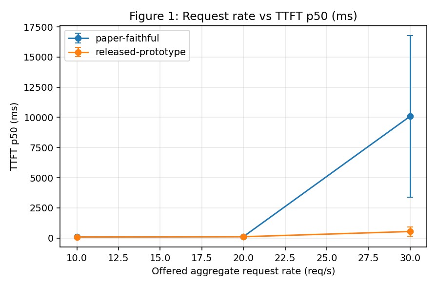
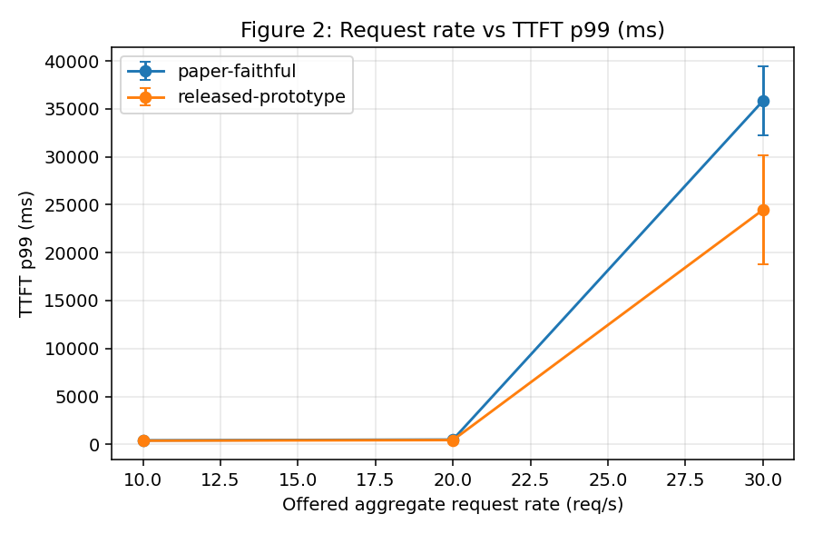
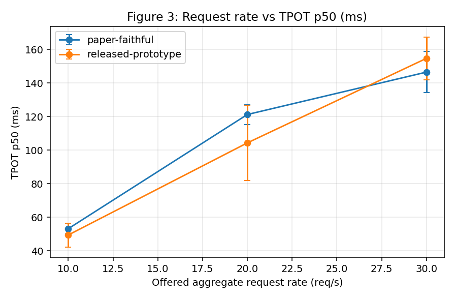
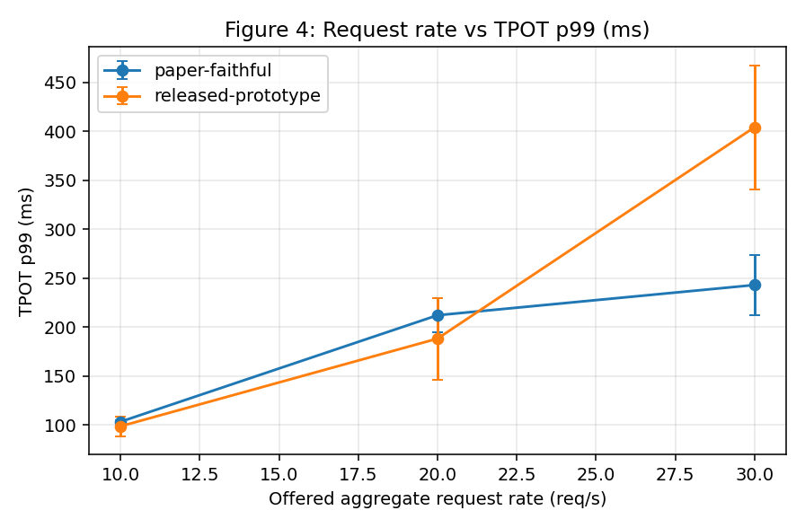
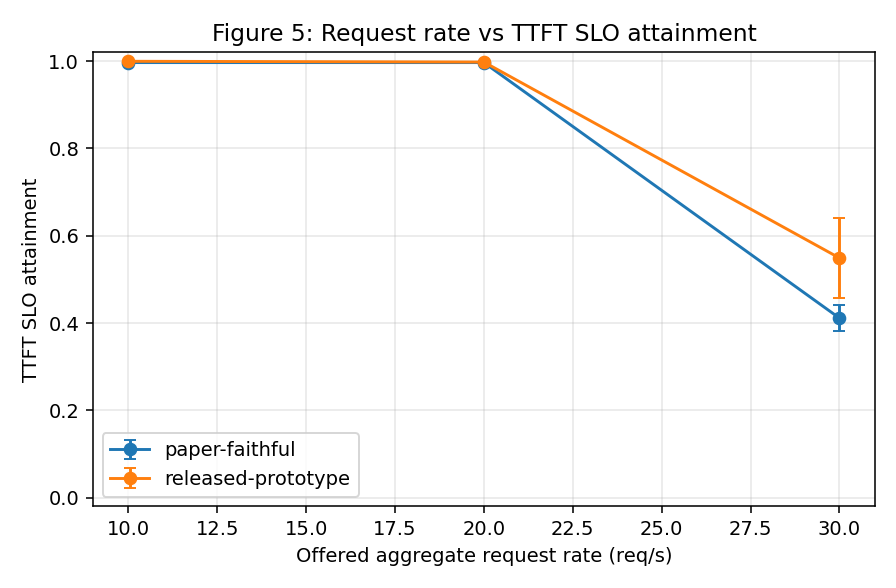
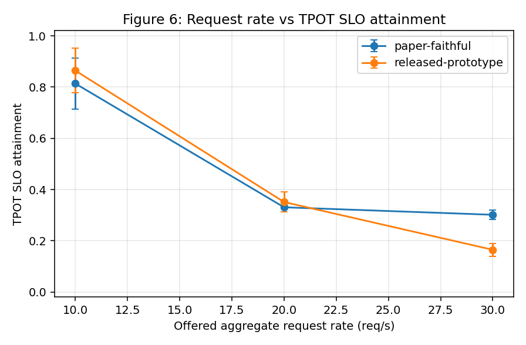
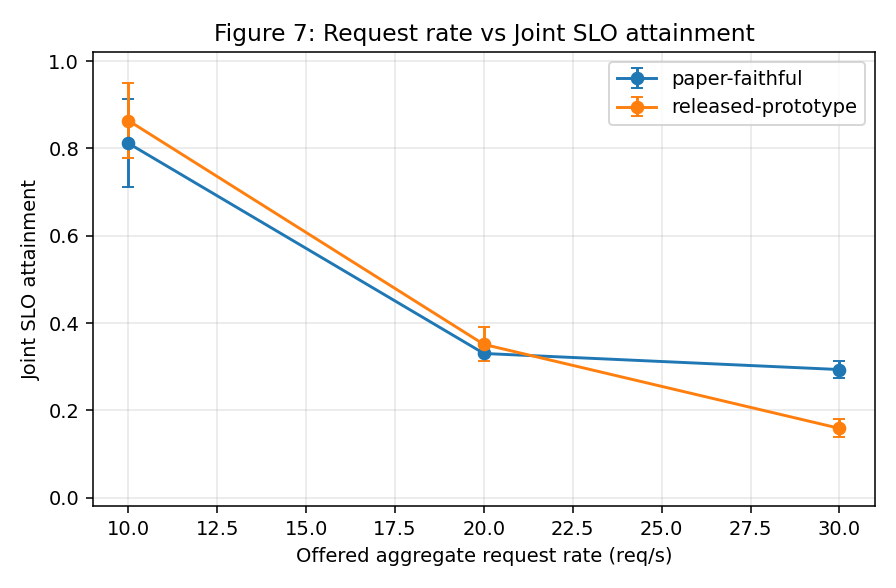
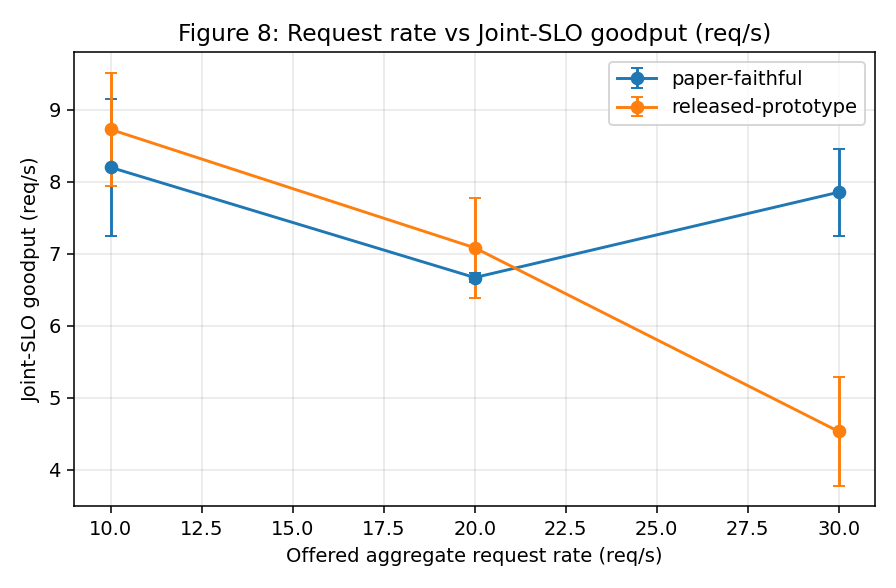

# Released Prism Prototype vs Paper-Faithful Prism

> `exp/scripts/aggregate_pf.py` 가 자동 생성한다. 수치는 seed 평균이며 괄호 없이 표기된 값은 평균, `summary.csv` 에 seed 간 표준편차가 함께 들어 있다. n=3 이므로 표준편차는 산포의 지표일 뿐 유의성 주장이 아니다.

## 1. 연구 질문

요청 유입률이 올라갈 때, 논문의 **Algorithm 1**(KVPR 기반 전역 모델 배치)과 **Algorithm 2**(Moore-Hodgson GPU-로컬 요청 스케줄링)를 논문에 충실하게 구현하면 공개된 `prism-research` 프로토타입보다 TTFT · TPOT · SLO 달성률 · Joint-SLO Goodput 에서 더 나은 결과가 나오는가?

두 arm 은 **스케줄러 정책만** 다르다. GPU, 모델, 정밀도, kvcached, ShareGPT 요청, 프롬프트, 출력 길이, 도착 시각, seed, SLO, 워밍업, 측정 구간은 전부 동일하다.

## 2. 프로토타입과 논문은 무엇이 다른가

줄 단위로 대조한 감사 결과는 `docs/paper_faithful/design_analysis.md` 에 있다. 요약하면 프로토타입의 전역 배치는 여유 메모리 바이트당 **요청 개수**(평활값)를 균형 지표로 쓰고 15배 비율 임계로 마이그레이션을 판단하며, 로컬 스케줄러는 `deadline − exec` 우선순위 힙일 뿐 `net_available = float('inf')` 로 사실상 **전부 admit** 한다. KVPR 지표도, Moore-Hodgson 의 핵심인 **가장 긴 작업을 떨어뜨리는 단계**도 공개 코드에는 존재하지 않는다.

## 3–6. 하드웨어 · 소프트웨어 · 모델 · 워크로드

```
timestamp: 2026-08-14T02:14:03+00:00
git_branch: exp/paper-faithful-prism
git_commit: 559b7945103592212eb04f61df8bb13cb1248e9f
prism_research_commit: 595ec1f170e75a43897a7a2ad58ac5a9820aa2e8
kvcached_branch: HEAD
kvcached_commit: d78649d0c2b7d2ff32eb48a423df7bf60054f4c9
cuda_version: 12.1
torch_version: 2.4.0+cu121
driver: 570.211.01
gpu_model: NVIDIA A100-SXM4-80GB
gpu_count: 2
models: 3x meta-llama/Llama-3.1-8B in slots 1,4,5
request_rate_semantics: aggregate over all models (per-model = rate/3)
rates: 30 20 10
seeds: 1 2 3
systems: released-prototype paper-faithful
ttft_slo_scale: 5
tpot_slo_scale: 3
kvpr_tau: 0.35
kvpr_rate_window_s: 30
kvpr_migration_cooldown_s: 30
global_scheduler_interval_s: 5 (upstream SCHEDULE_INTERVAL)
warmup_s: 60
measure_s: 300
trace_phase_len_s: 360
```

워크로드: ShareGPT 텍스트, gamma(cv=1)=Poisson 도착. (rate, seed) 조합마다 트레이스 하나를 만들어 **두 시스템이 같은 파일을 공유**하므로 프롬프트 · 길이 · 라우팅 · 도착 시각이 arm 사이에 완전히 동일하다.

## 11–14. 결과

| Rate | System | TTFT p50 | TTFT p99 | TPOT p50 | TPOT p99 | TTFT 달성률 | TPOT 달성률 | Joint 달성률 | Goodput |
| ---: | --- | ---: | ---: | ---: | ---: | ---: | ---: | ---: | ---: |
| 10 | released-prototype | 82.4 | 383.2 | 49.4 | 98.5 | 0.999 | 0.864 | 0.864 | 8.73 |
| 10 | paper-faithful | 89.9 | 415.0 | 53.2 | 103.1 | 0.996 | 0.813 | 0.812 | 8.20 |
| 20 | released-prototype | 101.3 | 448.4 | 104.3 | 188.1 | 0.998 | 0.351 | 0.351 | 7.08 |
| 20 | paper-faithful | 114.1 | 495.0 | 121.2 | 212.0 | 0.996 | 0.331 | 0.330 | 6.67 |
| 30 | released-prototype | 534.7 | 24465.8 | 154.6 | 404.1 | 0.549 | 0.165 | 0.159 | 4.53 |
| 30 | paper-faithful | 10089.1 | 35836.7 | 146.4 | 242.9 | 0.411 | 0.301 | 0.293 | 7.86 |

지연 단위는 ms, Goodput 단위는 req/s.

## 17–18. 유입률별 Paper-Faithful 대 프로토타입

지연 개선율 = (프로토타입 − 논문충실) / 프로토타입, Goodput · 달성률 개선율 = (논문충실 − 프로토타입) / 프로토타입. 어느 지표든 **양수면 Paper-Faithful 이 우세**하다.

| Rate | TTFT p99 | TPOT p99 | Joint 달성률 (pp) | Joint 달성률 (상대) | Goodput |
| ---: | ---: | ---: | ---: | ---: | ---: |
| 10 | -8.3% | -4.7% | -5.2pp | -6.0% | -6.0% |
| 20 | -10.4% | -12.7% | -2.1pp | -5.9% | -5.8% |
| 30 | -46.5% | +39.9% | +13.5pp | +84.8% | +73.2% |

## 15–16. 진단 지표

| Rate | System | 마이그레이션 | 축출 | 활성화 | MH 지연 | 완료 | 실패 |
| ---: | --- | ---: | ---: | ---: | ---: | ---: | ---: |
| 10 | released-prototype | 0.3 | 0.0 | 0.0 | 0.0 | 3033.3 | 0.0 |
| 10 | paper-faithful | 0.7 | 0.0 | 0.0 | 18.7 | 3033.3 | 0.0 |
| 20 | released-prototype | 1.0 | 0.7 | 0.0 | 0.0 | 6060.7 | 0.0 |
| 20 | paper-faithful | 2.0 | 1.3 | 0.0 | 58.3 | 6060.7 | 0.0 |
| 30 | released-prototype | 2.3 | 1.0 | 0.0 | 0.0 | 8553.7 | 549.3 |
| 30 | paper-faithful | 2.7 | 2.0 | 0.0 | 4089.0 | 8029.0 | 1074.0 |

`MH 지연` 은 Moore-Hodgson 이 한 번이라도 실행가능 집합에서 제외한 **서로 다른** 요청 수다(라운드마다 중복 계수하지 않는다).

## 두 arm 이 실제로 다른 스케줄러로 돌았다는 증거

플래그가 파싱되었다는 것만으로는 부족하므로, 런마다 서버 로그에서 알고리즘 표식을 세어 게이트로 검증했다.

| System | `[PAPER-ALG1]` 로그 | `[PAPER-ALG2]` 로그 |
| --- | ---: | ---: |
| released-prototype (9런 합계) | 0 | 0 |
| paper-faithful (9런 합계) | 6609 | 12426 |

## 왜 Paper-Faithful 이 프로토타입보다 나쁘게 나왔는가

결과는 유입률에 따라 갈린다. 중·저부하에서는 Paper-Faithful 이 근소하게 열세이고, 최고 부하에서는 Goodput 과 TPOT 꼬리가 크게 좋아지는 대신 TTFT 가 무너진다. 아래는 그 원인에 대한 **추정**이며, 각 항목에 어떤 관측이 근거이고 어디까지가 확증되지 않았는지 함께 적는다.

### 원인 1 (주원인, 증거 강함) — 순차 기계 모델이 배치 엔진에서 과소 수용을 만든다

Algorithm 2 는 `1‖ΣU_j`, 즉 **한 번에 한 작업만 처리하는 단일 기계** 문제다. 실행가능성 판정이 `clock += e_i` 누적이므로, k 번째로 넣는 요청을 앞의 k−1 개가 끝나기를 기다려야 하는 것처럼 계산한다. 그런데 서빙 엔진은 **한 배치에 여러 요청을 동시에 prefill** 한다. 따라서 이 판정은 GPU 가 아직 포화되지 않았는데도 '실행 불가능' 이라고 답한다.

유입률 30 req/s, seed 1 의 GPU 스케줄러 로그 실측:

| 항목 | 값 |
| --- | ---: |
| deferral 이 발생한 라운드 | 1,083 |
| 그 라운드들의 eligible 총합 | 5,729 (라운드당 5.29) |
| **그 라운드들의 selected 총합** | **246 (라운드당 0.227)** |
| 백프레셔로 되돌린 요청 | 1,024 (1,013 개 라운드) |
| 이미 마감이 지나 뒤늦게 내보낸 요청 | 4,459 |
| 최대 큐 길이 | 211 |
| (참고) 프로토타입 최대 큐 길이 | 178 |

`eligible=123, selected=0` 같은 라운드가 일상적으로 나온다. 엔진은 그 123 개를 배치로 소화할 수 있지만 단일 기계 판정은 하나도 통과시키지 않는다.

이것이 지연의 재배치가 아니라 **처리율 부족**이라는 근거는 구간별 TTFT 추이다. 성공한 요청을 도착 순서로 10 등분하고 각 구간의 TTFT 중앙값(초)을 보면:

| 구간 | 1 | 2 | 3 | 4 | 5 | 6 | 7 | 8 | 9 | 10 |
| --- | ---: | ---: | ---: | ---: | ---: | ---: | ---: | ---: | ---: | ---: |
| released-prototype | 0.09 | 0.10 | 0.12 | 0.52 | 0.20 | 0.14 | 3.63 | 7.01 | 0.18 | 0.14 |
| paper-faithful | 0.09 | 0.10 | 0.10 | 6.66 | 9.84 | 20.45 | 20.09 | 26.90 | 29.03 | 23.32 |

(유입률 30 req/s, seed 1)

프로토타입은 중간에 튀었다가 **원래 수준으로 회복**한다. Paper-Faithful 은 4 구간부터 올라가서 끝까지 내려오지 않는다. 지속 처리율이 유입률보다 낮아 백로그가 영영 드레인되지 않는다는 뜻이고, 이는 '느린 요청을 버린 대가' 가 아니라 **과소 수용**의 서명이다.

### 원인 2 (해석 주의, 증거 강함) — 최고 부하의 유리한 수치도 같은 원인에서 나온다

Paper-Faithful 의 TPOT p99 개선과 Joint Goodput 증가는 실재하는 측정값이다. 다만 메커니즘은 '더 잘 스케줄해서' 가 아니라 **배치에 요청을 적게 넣어서** 디코딩 경합이 줄어든 것이다. 들어간 요청은 쾌적하게 서비스되고, 들어가지 못한 요청은 수십 초를 기다린다. Goodput 개선만 떼어 보고하면 스케줄링 품질 향상으로 오귀인하게 된다.

### 원인 3 (증거 있음) — 중·저부하에서는 Algorithm 2 가 이득 없이 비용만 남는다

부하가 낮으면 마감을 못 맞출 요청 자체가 거의 없다. 위 진단표의 `MH 지연` 값이 저부하에서 급감하는 것이 그 증거다. 이때 Moore-Hodgson 은 매 라운드 정렬과 힙 연산을 수행하지만 떨어뜨릴 것이 없으므로, 프로토타입 대비 순수한 오버헤드로 남는다. 관측된 열세 폭(Goodput 5~6 %)은 seed 간 표준편차와 같은 크기라 이 데이터만으로는 **분해되지 않는다** — 방향이 일관될 뿐이다.

### 원인 4 (추정, 미확증) — 마감 산정에 큐 대기가 반영되지 않는다

`d_i = a_i + s_i` 는 도착 시각 기준의 절대 마감이고, `e_i = p_i / c_i` 는 **prefill 시간만** 센다. 디코딩 시간도, 큐에서 이미 보낸 시간도 들어가지 않는다. 과부하로 백로그가 쌓이면 대다수 요청이 큐에 앉아 있는 동안 마감을 넘겨 버리고, 그 뒤로는 Moore-Hodgson 이 판단할 여지 없이 전부 '이미 늦음' 경로로 빠진다. 위 표에서 late_dispatched 가 selected 보다 훨씬 큰 것이 이 상태와 부합한다. 다만 이것이 **독립적인 원인인지, 원인 1 의 결과인지는 이 데이터로 구분되지 않는다.** 구분하려면 원인 1 을 제거한 조건에서 다시 측정해야 한다.

### 원인 5 (추정, 반증됨에 가까움) — 마이그레이션 비용

이 프로토타입의 마이그레이션은 stop-the-world 동작이므로, 횟수가 늘면 그 자체로 지연을 만든다. 그러나 실측 마이그레이션 횟수는 두 arm 이 거의 같다(아래 §Algorithm 1). 따라서 관측된 차이의 설명으로는 **적합하지 않다.**

## Algorithm 1 은 왜 아무 차이도 만들지 못했는가

이 구성에서 Algorithm 1 은 **작동할 여지가 없다.** 모델 3 개를 GPU 2 개에 올리면 배치는 반드시 1+2 이고, 두 개가 올라간 GPU 의 KVPR 은

```
peak KVPR ≈ (w + w) / (67.28 − 2×15.08 GiB) = 2w / 37.12
```

로, **어느 모델을 겹치게 놓든 같다.** 목적함수가 평평하므로 argmin 은 추정 잡음이 정한다. 스모크 런의 24 회 결정에서 개선폭 분포는 평균 **+0.002**, 표준편차 **0.175** 였다. 기대 이득이 0 인 셈이고, `τ = 평균 + 2σ ≈ 0.35` 는 그 잡음 위에 선을 그은 값이다(지연 결과가 아니라 추정기 자체의 분포에서 유도했다).

결과적으로 두 arm 의 마이그레이션 횟수는 실질적으로 같고, 위에서 관측된 차이는 **사실상 전부 Algorithm 2 에서 나온다.** 여기서의 무차이는 KVPR 에 대한 반증이 아니라 **이 구성에서는 측정 불가**라는 뜻이다. 논문의 설정(모델 수·GPU 수가 많고 크기와 유입률이 이질적)에서는 목적함수가 평평하지 않다.

## 논문 내용 중 구현하지 않았거나 검증하지 못한 부분

의도적 선택, 환경 제약, 정보 부재를 구분해 전부 적는다. 자세한 근거는 `docs/paper_faithful/design_analysis.md` 에 있다.

| 논문 내용 | 이번 작업에서의 상태 | 이유 |
| --- | --- | --- |
| TP 샤드 anti-affinity 제약 | **구현했으나 한 번도 발동하지 않음** | 전 구성이 TP=1 이라 같은 모델의 다른 샤드가 존재하지 않는다. 코드 경로는 있으나 이번 실험이 검증하지 못했다 |
| Algorithm 2 의 배치 병렬성 보정 | **구현하지 않음 (의도적)** | 논문에 없는 항이다. `clock += e_i / B` 같은 보정을 넣으면 Algorithm 2 가 아닌 것을 측정하게 된다. 가장 유력한 후속 실험이며 별도 arm 으로 라벨링해 돌려야 한다 |
| 논문의 다중 GPU · 8 모델 혼합 구성 | **재현하지 않음** | 정확한 구성이 공개되어 있지 않고, 2 GPU 에서는 이 유입률로 재현 자체가 불가능하다. 재현했다고 주장하지 않는다 |
| 이기종 모델 크기 · 이기종 유입률 | **다루지 않음** | 3 × Llama-3.1-8B 동일 모델이다. KVPR 목적함수가 평평해진 직접적 원인이기도 하다 |
| 마이그레이션 비용 모델 / 오버랩 마이그레이션 | **구현하지 않음** | 프로토타입의 마이그레이션은 stop-the-world 다. 논문이 비용을 어떻게 산정하는지 공개 정보로는 확정할 수 없어, 쿨다운으로만 빈도를 제한했다 |
| kvcached 메모리 벌루닝 | **재구현하지 않음 (요구사항)** | 핀 고정된 `ovg-project/kvcached` `prism/shm` 을 그대로 쓴다. 두 arm 에 동일하게 적용된다 |
| 모델 활성화 · 비활성화 · 유휴 축출 정책 | **프로토타입 것을 그대로 사용** | 논문이 임계값을 명시하지 않는다. `MODEL_IDLE_THRESHOLD = 50 s` 를 두 arm 에 동일 적용해 교란 변수가 되지 않게 했다 |
| 논문의 SLO 절대값 | **이 장비에서 재측정해 사용** | 논문 수치는 저자 하드웨어 기준이다. 무경합 p95 (TTFT 125.7 ms, TPOT 21.41 ms)를 §7.1 방식으로 다시 재고 ×5 / ×3 스케일을 적용했다. 두 arm 이 같은 값을 쓴다 |
| `c_i` (모델별 chunked-prefill 속도) | 논문에 값이 없어 **측정해서 사용** | 무경합 런에서 비율 추정기로 4,214 tok/s. 임의 상수를 쓰지 않았다 |
| Moore-Hodgson 이 제외한 요청의 처리 | 논문에 없어 **직접 정의** | 마감 전이면 재큐잉, 마감 후면 실행가능 집합 뒤에 배치. 전부 재큐잉하면 livelock 이 발생한다 |
| Joint-SLO Goodput | 논문에 없는 지표라 **직접 정의** | `SLO 를 모두 만족한 완료 요청 수 / 측정 300 s` |

## 그림










## 19. 한계

- 포인트당 seed 3 개다. 집계값에는 충분하지만 p99 에는 얇다. `summary.csv` 의 seed 간 표준편차가 두 arm 의 차이와 비슷한 크기인 구간은 **이 데이터로 분해되지 않는다.**
- `τ`, 토큰율 측정 창, Moore-Hodgson 제외 요청의 처리 방식은 논문에 명시가 없다. 사용한 값은 메타데이터와 `design_analysis.md` 에 기록했다. 어느 arm 에도 유입률별 튜닝을 적용하지 않았다.
- GPU 2 개에 모델 3 개는 필연적으로 1+2 분할이므로 어떤 배치 정책도 부하를 균등화할 수 없다. Algorithm 1 이 여기서 낼 수 있는 성능의 상한을 이 사실이 정한다.
- 프로토타입은 논문의 아티팩트가 아니라 단순화된 연구용 공개본이다. 여기서 측정된 차이는 **프로토타입 대 논문 알고리즘**이지 **저자 구현 대 논문**이 아니다.
- `server-logs/` 와 `requests/` 는 용량 때문에 git 에 올리지 않는다. 원인 분석 절의 라운드 통계와 구간별 TTFT 를 다시 계산하려면 실험을 돌린 장비에서 `diagnose_pf.py` 를 실행해야 한다.

## 20. 재현

```bash
source exp/scripts/env.sh
./exp/run_paper_faithful_comparison.sh --dry-run   # 실행 계획 출력
./exp/run_paper_faithful_comparison.sh --resume    # 스윕 실행 / 중단 지점부터 재개
python exp/tests/test_moore_hodgson.py             # Algorithm 2 단위 테스트
python exp/tests/test_kvpr_placement.py            # Algorithm 1 단위 테스트
python exp/scripts/diagnose_pf.py --base <결과 디렉터리>   # 진단 수치 재계산
```
