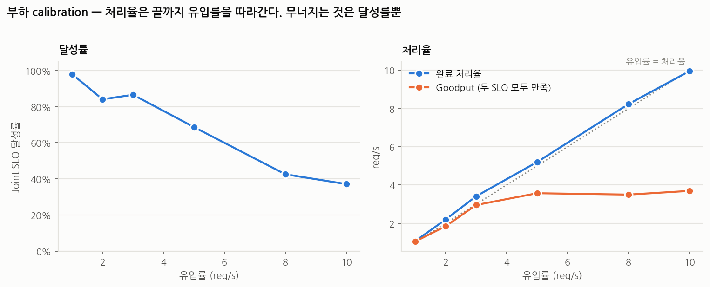
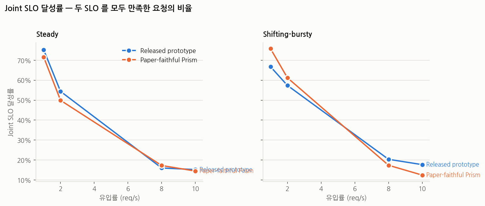
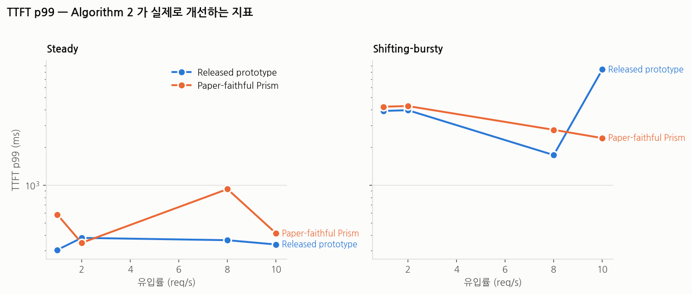
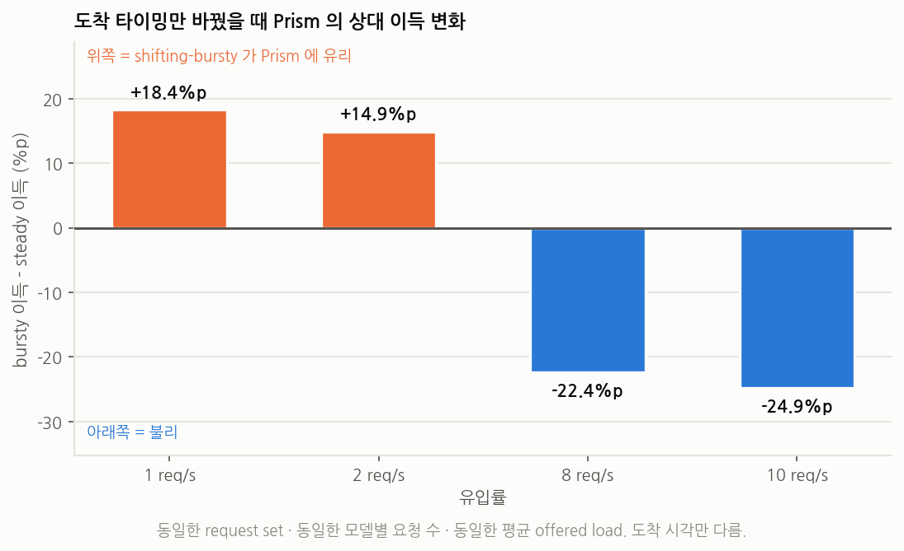
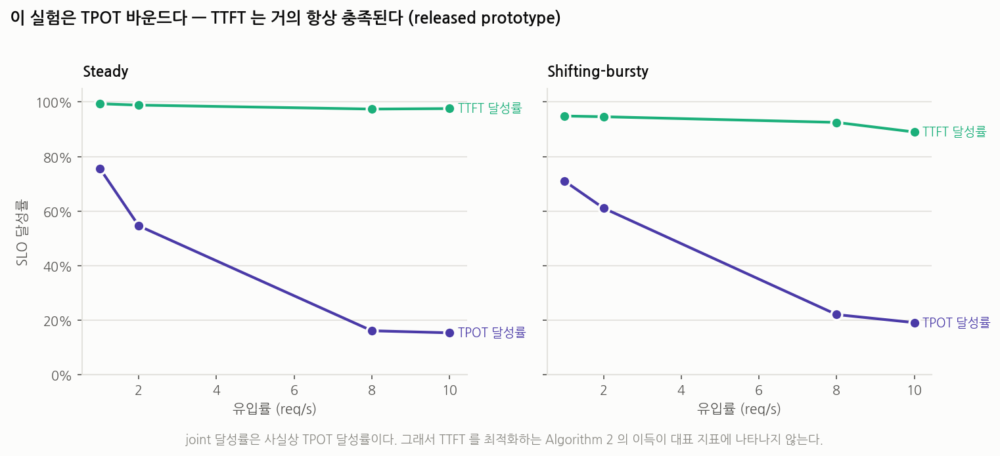
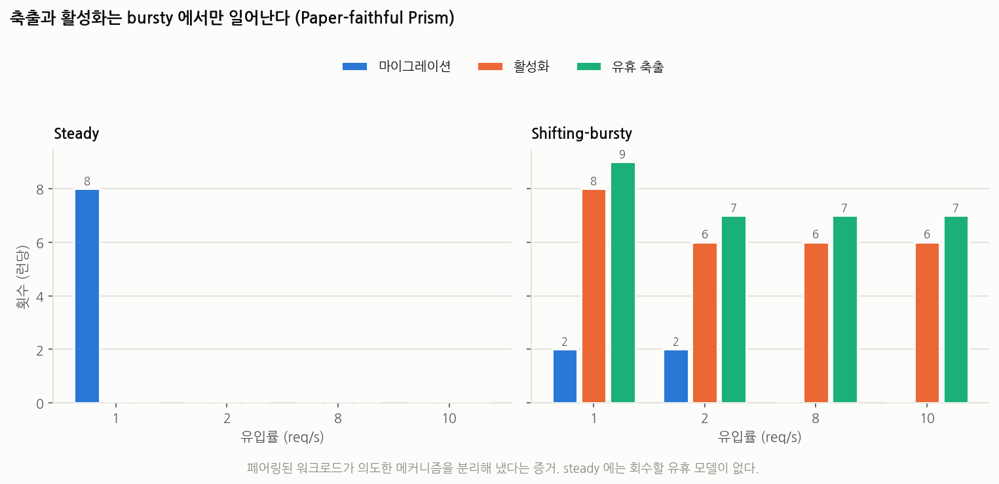
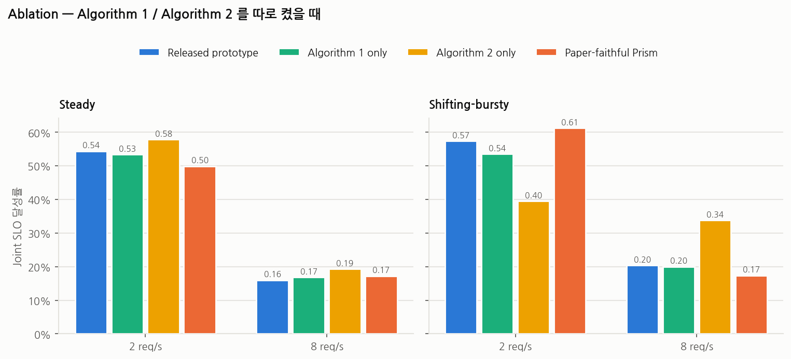

# Paper-Faithful Prism v2 — Shifting-Bursty 대 Steady

_`exp/scripts/build_report_v2.py` 가 생성. 하네스 커밋 `5742c9c`._

## 0. 읽기 전에 — 이 보고서가 무엇이고 무엇이 아닌가

숫자를 보기 전에 이 절을 읽으세요. 아래 여섯 가지는 표만 보면 반대로 읽히기 쉽습니다.

**① 여기서 "Prism" 은 저자들의 구현이 아니다.**
비교한 두 시스템은 다음과 같다.

| 이름 | 실체 |
| --- | --- |
| `released-prototype` | 공개된 `Multi-LLM/prism-research @ 595ec1f` 를 **그대로** 실행. 우리가 추가한 코드 경로는 전부 플래그 뒤에 있어 이 arm 에서는 한 줄도 실행되지 않는다 |
| `paper-faithful` | 논문(arXiv 2505.04021v3) 의 Algorithm 1·2 의사코드를 **우리가** 옮겨 심은 것 |

따라서 이 보고서가 측정한 것은 **공개 프로토타입 대 논문 알고리즘**이지,
**저자 구현 대 논문**이 아니다. 저자들의 실제 시스템은 공개되어 있지 않다.
"Prism 이 졌다/이겼다" 로 읽으면 안 되고, "이 구성에서 논문 알고리즘이 공개
프로토타입의 휴리스틱보다 나았다/못했다" 로 읽어야 한다.

**② 사용한 LLM 은 논문의 모델 세트가 아니다.**
논문의 정확한 구성은 공개되어 있지 않다. §2 의 6모델은 우리가 고른 것이며,
선정 기준은 성능이 아니라 **KV cell size 가 파라미터 수와 단조가 아닐 것** 하나였다.
그래야 KVPR 이 "상주 가중치의 재라벨링" 으로 퇴화하지 않는다. 모델의 품질·정확도는
이 실험과 무관하다 — 모든 요청이 `ignore_eos=True` 로 고정 길이를 생성하므로
출력 내용은 측정에 전혀 들어가지 않는다.

**③ joint 달성률이 0.12~0.76 인 것은 시스템 고장이 아니다.**
SLO 를 이 장비의 **무경합 단독 p95 × (TTFT 5배, TPOT 3배)** 로 잡았기 때문이다.
GPU 한 장에 모델 3개가 상주해 디코딩을 나눠 쓰는 구성에서 이 목표는 저부하에서도
빡빡하다. 처리율은 **모든 부하에서 유입률을 정확히 따라갔고**(1.03 / 2.09 / 8.04 /
10.16 req/s), 실패 요청은 0건, 최대 큐는 0~16 이었다. 즉 어느 런도 용량 포화나
붕괴 상태가 아니었다. 낮은 달성률은 **일부러 엄격하게 잡은 목표선**의 결과다.

**④ 이 실험 전체가 TPOT 바운드다. 그래서 Algorithm 2 의 이득이 대표 지표에 안 보인다.**
TTFT 달성률은 모든 런에서 0.89~0.99 이므로 joint 달성률은 사실상 TPOT 달성률이다.
Algorithm 2 는 TTFT 를 최적화하는 알고리즘이고 실제로 잘 작동했다 — 10 req/s bursty
에서 TTFT p99 를 8,370 ms 에서 2,374 ms 로 3.5배 줄였다. 그런데 그 지표가 병목이
아니었으므로 joint 달성률은 오히려 낮게 나온다. **"Algorithm 2 가 성능을 떨어뜨렸다"
로 읽으면 틀린다.** 이 구성이 그 알고리즘이 겨냥한 지표를 측정하지 못한 것이다.

**⑤ 부하 수준당 seed 가 1개다.**
따라서 개별 지점의 차이(예: 8 req/s 의 0.174 대 0.204)를 유의하다고 주장하지 않는다.
근거로 삼는 것은 **부호가 부하에 대해 단조롭게 뒤집힌다**는 패턴이지 개별 숫자가 아니다.
seed 를 늘리기 전까지 이 보고서의 어떤 단일 비교도 통계적 주장으로 쓰면 안 된다.

**⑥ `c_i` 와 SLO 기준선은 이 장비 전용이다.**
`exp/configs/v2/` 의 값은 A100-SXM4-80GB 에서 측정한 것이고, Algorithm 2 의
실행가능성 판정과 Algorithm 1 의 KVPR 가중을 직접 결정한다. 다른 장비에서 재사용하면
안 되며, `exp/scripts/run_profiling_v2.sh` 로 다시 재야 한다.

## 1. 실험 환경

| 항목 | 값 |
| --- | --- |
| GPU | 2 x NVIDIA A100-SXM4-80GB, 81920 MiB |
| Driver | 580.173.02 |
| CPU | AMD EPYC 7V12 64-Core Processor |
| RAM | 1007 GiB |
| OS | Linux 6.8.0-137-generic |
| CUDA (torch) | 12.1 |
| torch | 2.4.0+cu121 |
| SGLang (prism-research fork) | 0.3.4.post2 |
| prism-research commit | 595ec1f170e75a43897a7a2ad58ac5a9820aa2e8 |
| kvcached commit (prism/shm) | d78649d0c2b7d2ff32eb48a423df7bf60054f4c9 |
| Prism harness branch | exp/paper-faithful-v2 |
| Prism harness commit | 5742c9c12528b16461befd9241099abe92d74716 |

## 2. 모델

| 슬롯 | 모델 | 파라미터 | dtype | 가중치 (GiB) | KV cell (B/token) | TTFT p95 (ms) | TPOT p95 (ms) |
| --- | --- | --- | --- | ---: | ---: | ---: | ---: |
| model_1 | `meta-llama/Llama-3.2-1B` | 1.24B | bf16 | 2.28 | 32768 | 24.6 | 7.11 |
| model_2 | `Qwen/Qwen2.5-1.5B-Instruct` | 1.54B | bf16 | 3.01 | 28672 | 33.5 | 11.08 |
| model_3 | `meta-llama/Llama-3.2-3B` | 3.21B | bf16 | 6.00 | 114688 | 57.4 | 12.43 |
| model_4 | `Qwen/Qwen2.5-3B-Instruct` | 3.09B | bf16 | 5.84 | 36864 | 56.7 | 15.66 |
| model_5 | `meta-llama/Llama-3.1-8B` | 8.03B | bf16 | 15.08 | 131072 | 116.7 | 12.97 |
| model_6 | `Qwen/Qwen2.5-7B-Instruct` | 7.62B | bf16 | 14.28 | 57344 | 105.3 | 12.62 |

KV cell size 가 파라미터 수와 **단조가 아니도록** 일부러 골랐다. `model_3` 은 같은 크기의 `model_4` 보다 토큰당 KV 를 3.1배, `model_5` 는 `model_6` 보다 2.3배 쓴다. 이렇게 하지 않으면 KVPR 이 상주 가중치의 재라벨링으로 퇴화해 Algorithm 1 의 목적함수가 평평해진다 — v1 의 3 x Llama-3.1-8B 구성에서 실제로 그랬다.
TTFT/TPOT p95 는 이 장비에서 잰 무경합 단독 측정값이다(논문 §7.1 방식). 아래에서 쓰는 SLO 는 이 값에 스케일을 곱한 것이다.

## 3. 구현 상태

arXiv **2505.04021v3** (OSDI 개정판) 원문과 핀 고정된 프로토타입
`Multi-LLM/prism-research @ 595ec1f` 를 줄 단위로 대조했다.

### 3.1 논문에 명시된 것 — 쓰인 그대로 구현

| 논문 | 구현 위치 |
| --- | --- |
| Alg. 1 line 1: 모델을 `t_j * tz_j / s_j` 내림차순 정렬 | `kvpr_global.py::_greedy_placement` |
| Alg. 1 lines 2-3: `shared_kv_i <- C`, `w_token_rate_i <- 0` | 동일 |
| Alg. 1 line 6: `w_token_rate_i / shared_kv_i` 를 최소화하는 GPU 선택 | 동일 |
| Alg. 1 lines 9-11: 배정 후 두 누적기 갱신 | 동일 |
| `tz_j` = 토큰당 KV 바이트 | `model_info.json::cell_size` |
| Alg. 2 line 1: `d_i = a_i + s_i` 오름차순 정렬 | `moore_hodgson.py::select` |
| Alg. 2 lines 4-6: `e_r = p_r / c_r`, 추가, `clock += e_r` | 동일 |
| Alg. 2 lines 7-11: 초과 시 **가장 긴** 작업 제거 후 시계 되감기 | 동일 |
| Alg. 2 line 12: `S` 를 스케줄 순서로 디스패치 | `request_queue_mh.py` |
| GPU 별 공유 요청 큐 (§6.2) | 프로토타입 `RequestQueue` 재사용 |
| 유휴 모델 축출 / 요청 도착 시 재활성화 | 프로토타입 `SimpleGlobalPolicy` 상속 |
| TP anti-affinity | 구현했으나 한 번도 발동 안 함 — 전 구성이 TP=1 |
| GPU 메모리 벌루닝 (§5) | 핀 고정 `kvcached` `prism/shm`, 무수정, 두 arm 동일 |

`released-prototype` 은 상류 코드 경로를 그대로 실행한다. 우리가 추가한 모든 경로는
`--policy kvpr-global` / `--enable-moore-hodgson` 뒤에 있어 그 arm 에서는 실행되지 않는다.
런마다 서버 로그의 `[PAPER-ALG1]` / `[PAPER-ALG2]` 표식 개수로 이를 검증했다(§4 검사 0).

### 3.2 우리의 가정 — 논문이 정하지 않은 것들

| 항목 | 논문 | 우리 결정 | 이유 |
| --- | --- | --- | --- |
| `tau` 의 단위 | Alg. 1 line 8 이 `current_r - best_r > tau` 로 절대 비교하는데, KVPR 은 차원을 가지며 단위도 값도 제시하지 않음 | 무차원. 클러스터 **peak** KVPR 의 상대 감소분, 기본 0.35 | "클러스터 최대 KVPR 을 억제한다" 가 이 greedy 근사에 대한 논문 자신의 목표 서술(Analysis / App. A.2)이다. 상대 기준은 구성이 달라도 비교 가능하지만 절대 기준은 그렇지 않다 |
| Alg. 1 line 10 누적항 | `+= r_k / s_k` 로 인쇄되어 line 1 의 정렬 키 `t_j*tz_j/s_j` 와 모순 | 양쪽 모두 `t_k*tz_k/s_k` | line 10 은 분자가 요청률이던 arXiv v1 의 잔재다 |
| KVPR 의 `s_j` | "latency SLO" | **TPOT** SLO 기준선 × `--kvpr-tpot-slo-scale` | KVPR 은 메모리 압력을 모델링하고, 메모리 여유가 지배하는 것은 TPOT 이다(논문 §6.2 Analysis) |
| `t_j` 정의 | "token rate" | 슬라이딩 창 기준 admit 된 입력 tok/s **+** 엔진 보고 디코드 tok/s | KV 캐시가 실제로 자라는 속도 |
| 토큰율 측정 창 | 미지정 | 30초 | 프로토타입의 `ModelRequestTracker` 창과 맞춰, 창 길이가 두 arm 사이 교란변수가 되지 않게 함 |
| 전역 스케줄러 주기 | 미지정 | 5초 | 프로토타입 하드코딩 `SCHEDULE_INTERVAL`. 두 arm 동일 |
| 마이그레이션 쿨다운 | 논문에 항목 자체가 없음 | 30초 | 결정은 5초마다지만 비율 추정은 30초 평균이라, 연속 패스는 입력의 25/30 을 공유해 독립 관측이 아니다 |
| 사이클당 마이그레이션 수 | 미지정 | 최대 1회 | 프로토타입과 동일. 여기서 마이그레이션은 stop-the-world 다 |
| GPU 를 비우지 않음 | 미지정 | 강제 | 런처가 초기 배치에 있는 GPU 에만 스케줄러를 띄우므로, 비워진 GPU 는 런 내내 죽어 있다 |
| `c_i` | "모델이 결정하는 chunked-prefill 속도" — 값도 방법도 없음 | **측정값**: 포화 상태 prefill burst 에서의 총 prefill 토큰 처리량. 엔진의 `out_queue -> prefill_finish` 타임스탬프 기준 | §3.4 참조 |
| Alg-2 가 제외한 요청의 처리 | 미지정 | `d_i > now` 재큐잉, `d_i <= now` 는 `S` 뒤 최하위로 디스패치 | Moore-Hodgson 은 모든 작업이 실행된다는 전제에서 *늦은 작업의 개수*를 최소화한다. 이미 늦은 것을 붙잡아 두면 livelock 이며 판정이 매 라운드 동일하다(회귀 테스트 `test_moore_hodgson.py` #9) |
| 유휴 축출 임계 | "경험적", App. A.4 가 약 45초 인용 | 프로토타입의 `MODEL_IDLE_THRESHOLD = 50초` 그대로 | 논문과 정합적이고 두 arm 에 동일 적용 |
| SLO 절대값 | 저자 하드웨어 기준 | 이 장비에서 §7.1 방식으로 재측정, TTFT ×5 / TPOT ×3 | 논문 수치는 이 장비의 기준선이 아니다 |
| Joint-SLO goodput | 논문 지표가 아님 | 여기서 정의: 두 SLO 를 모두 만족한 완료 요청 수 / 측정 구간 | — |

### 3.3 남은 불일치 — 논문에 있으나 여기에 없는 것

| 논문 | 상태 | 비고 |
| --- | --- | --- |
| 오버랩 마이그레이션 (대상이 준비될 때까지 원본이 계속 서비스) | **미구현** | 프로토타입은 원본을 비활성화한 *뒤* 대상을 활성화하며 `evict_waiting_requests=True` 다. stop-the-world |
| 재사용 가능한 사전 초기화 엔진 풀 | **부분** | worker pool 은 있으나 컨텍스트 사전 예열은 없음 |
| 병렬 가중치 로딩 (§5.3) | **부분** | `model_sevice.py` 가 `broker_gpu_id = (broker_id + target_gpu_id + 1) % num_gpus` 를 계산하므로, GPU 2장에서는 비대상 broker 가 하나뿐이라 병렬도가 최대 2 |
| NVLink / GPUDirect 가중치·KV 전송 | **미구현** | — |
| CPU DRAM 축출 계층 | 사용 안 함 | — |
| 프로덕션 트레이스 (Hyperbolic / Novita / Arena) | **비공개** | `--csv-trace` 는 파싱만 되고 쓰이지 않는다. 여기 워크로드는 ShareGPT 내용 + 합성 도착 시각이다 |
| 기준선 MuxServe++ / QLM / ServerlessLLM | 미설치 | torch/vllm 핀이 충돌해 각각 자기 venv 가 필요하다 |
| §7.4 규모 (모델 58개 / GPU 32장) | 불가능 | GPU 2장 |
| TP > 1 | 사용 안 함 | 전 구성이 TP=1 |

### 3.4 v1 에서 무엇이 왜 바뀌었나

**`c_i`.** v1 은 `Σ prompt tokens / Σ TTFT` 를 **경합 상태** 런에서 계산해
`c_i = 4,214 tok/s` 를 얻었고, `e_i = p_i / c_i` 에 절편 항이 없으니 `c_i` 는 전체
prefill 시간을 재현하는 양이어야 한다는 논리를 근거로 삼았다. 문제는 분모다. 경합
상태의 TTFT 는 대부분 큐 대기이므로 그 비율은 prefill 속도가 아니라 큐 지연을 잰다.
논문은 `c_i` 를 "모델이 결정하는 chunked-prefill 속도" 라고 부르고, 최적성 논증
(§6.2 Analysis)은 prefill 이 매 inference step 에서 속도 `c` 로 돈다고 전제한다 —
이는 **엔진 처리량**이지 한 요청 지연의 역수가 아니다.

이 구분이 중요한 이유는, 단일 기계 실행가능성 검사 `clock += e_i` 가 옳은 모델인지를
그것이 결정하기 때문이다. `c_i` 를 **총 용량**으로 읽으면 요청들은 실제로 그 용량의
단일 prefill 파이프라인을 두고 줄을 서므로 누적 방식이 맞고, 배치 병렬도 보정은
필요 없다. **요청당 속도**로 읽으면 같은 검사가 이중 계산을 하고 과소 수용한다.
v1 의 under-admission 은 Algorithm 2 의 결함이 아니라 `c_i` 와 기계 모델의 불일치와
정합적이다.

v2 는 prefill 구간을 엔진의 `out_queue_timestamp -> prefill_finish_timestamp` 로
직접 재고, 네 가지 추정기를 나란히 보고한다(§3.5). Algorithm 2 에 넣는 값은 포화
상태의 총 처리량이다.

**모델 세트.** v1 은 동일한 Llama-3.1-8B 3개를 썼는데, 이러면 어느 쌍을 겹치든
KVPR 이 `2w / (C - 2×15.08)` 로 같아 Algorithm 1 이 결정할 것이 없다. v2 는 KV cell
size 가 파라미터 수와 단조가 아닌 6모델을 쓴다.

**워크로드.** v1 은 일정 유입률 ShareGPT 트레이스라 어떤 모델도 유휴가 되지 않고
회수할 메모리가 애초에 없었다. v2 는 shifting-bursty 와 정확히 페어링된 steady
대조군을 추가한다.

**계측.** 두 알고리즘이 이제 결정마다 구조화된 기록을 남기고, Algorithm 2 는
`eligible > 0 이면서 selected = 0` 이 20라운드 연속되면 `[PAPER-ALG2-WARN]` 을
띄운다 — v1 이 손으로 찾아낸 바로 그 병리다.

### c_i 추정기 (tokens/s)

*추정기에 따라 최대 10배까지 갈린다. Algorithm 2 에 넣는 값은 포화 상태의 총 prefill 처리량(E3sat)이다.*

| 슬롯 | E1 비율 Σp/Σttft | E2 회귀 기울기 | E2 절편 (ms) | E3 실측 prefill, 단독 | E3 실측 prefill, 포화 | **사용값** |
| --- | ---: | ---: | ---: | ---: | ---: | ---: |
| model_1 | 38925 | 107492 | 9.9 | 49408 | 53634 | **53634** |
| model_2 | 29176 | 85487 | 13.5 | 35700 | 43242 | **43242** |
| model_3 | 20293 | 37875 | 13.8 | 23752 | 27057 | **27057** |
| model_4 | 19258 | 39910 | 16.1 | 22419 | 27414 | **27414** |
| model_5 | 11122 | 15761 | 15.9 | 12307 | 13702 | **13702** |
| model_6 | 11670 | 16889 | 15.8 | 13203 | 14759 | **14759** |

## 4. Sanity 게이트

| 검사 | 결과 | 통과 여부 |
| --- | --- | --- |
| 0. Algorithm 1 이 실제로 실행됨 | [PAPER-ALG1] 로그 45줄 (마이그레이션 2) | PASS |
| 0. Algorithm 2 가 실제로 실행됨 | [PAPER-ALG2] 로그 2줄 | PASS |
| A. c_i 예측 대 실측 prefill | 예측/실측 중앙값 0.071 (n=1619). 모델별 model_1:0.06, model_2:0.06, model_3:0.04, model_4:0.11, model_5:0.13, model_6:0.12. e_i 는 배치로 함께 처리된 요청 하나의 몫이므로 벽시계 구간보다 작은 것이 정상이며, 자릿수 오류만 잡는 검사다 | PASS |
| B. Algorithm 2 과소 수용 | pathological 라운드 0/479, eligible>0 이면서 selected=0 인 최대 연속 0회, selected/eligible=0.940 | PASS |
| B2. Algorithm 2 선택 비율 | selected/eligible=0.940 | PASS |
| C. GPU 유휴인데 큐 증가 | GPU 사용률<20% 이면서 큐>20 인 샘플 0/95 | PASS |
| D. KVPR 이 시간에 따라 변함 | peak KVPR 변동계수 0.353 (42사이클, 최소 2.41e+05, 최대 1.11e+08) | PASS |
| E. GPU 후보 간 KVPR 분리 | 사이클별 GPU 간 (max-min)/max KVPR 평균 0.597 | PASS |
| F. 스케줄러가 실제로 동작 | 마이그레이션 4, 활성화 4, 유휴 축출 4 | PASS |
| G. 지연 지표 정합성 | TTFT n=1619 p50=57.4ms p99=4073.7ms, TPOT n=1619 p50=23.92ms p99=70.84ms | PASS |
| H. 워크로드 재현성 | bursty_r8_s77.pkl: 원본 db0726e69b23 대 재생성 db0726e69b23 (SHA256) | PASS |

Hard 실패: **0건** — 게이트 통과, 본 실험 진행됨.

### 부하 calibration (released prototype, steady, 짧은 런)

*처리율은 끝까지 유입률을 따라간다. 무너지는 것은 달성률뿐이므로 이 실험 구간은 용량 포화가 아니라 SLO 바운드다.*

| 유입률 (req/s) | 처리율 | TTFT p50 (ms) | TTFT p99 (ms) | TPOT p50 (ms) | Joint 달성률 | Goodput | 최대 큐 |
| ---: | ---: | ---: | ---: | ---: | ---: | ---: | ---: |
| 1 | 1.07 | 62.9 | 287.0 | 21.6 | 0.980 | 1.05 | 0 |
| 2 | 2.20 | 74.7 | 250.8 | 28.3 | 0.841 | 1.85 | 0 |
| 3 | 3.41 | 75.6 | 330.2 | 29.1 | 0.866 | 2.96 | 0 |
| 5 | 5.20 | 77.0 | 343.4 | 31.6 | 0.687 | 3.57 | 0 |
| 8 | 8.23 | 80.3 | 331.8 | 38.0 | 0.425 | 3.50 | 0 |
| 10 | 9.95 | 84.9 | 342.1 | 41.8 | 0.371 | 3.69 | 0 |

## 5. 워크로드

| 유입률 (req/s) | 길이 (s) | Seed | 총 요청 | 평균 offered load | model_1 | model_2 | model_3 | model_4 | model_5 | model_6 |
| ---: | ---: | ---: | ---: | ---: | ---: | ---: | ---: | ---: | ---: | ---: |
| 10 | 420 | 1 | 4240 | 10.10 | 319 | 637 | 940 | 472 | 1190 | 682 |
| 1 | 420 | 1 | 442 | 1.05 | 37 | 66 | 97 | 51 | 125 | 66 |
| 2 | 420 | 1 | 858 | 2.04 | 60 | 138 | 200 | 94 | 237 | 129 |
| 8 | 420 | 1 | 3387 | 8.06 | 238 | 509 | 777 | 379 | 973 | 511 |

### Shifting Bursty

- 위상 길이 범위: 30~90 초 (랜덤, seed 고정)
- hot set 크기: 1~3개 모델, 위상마다 다시 뽑음
- 유입률 배수: HOT [3.0, 6.0], MEDIUM [0.8, 1.5], LOW [0.1, 0.4], IDLE = 0
- 기본 비중: {'model_1': 1.0, 'model_2': 1.0, 'model_3': 1.5, 'model_4': 1.5, 'model_5': 2.5, 'model_6': 2.5}
- seed: 1
- **집계 유입률은 모든 위상에서 같은 상수로 정규화된다.** 따라서 클러스터가 받는 총 부하는 전혀 움직이지 않고, 바뀌는 것은 *어느 모델이* hot 인가뿐이다. '클러스터가 더 바빠졌다' 를 교란변수에서 제거하고, Prism 이 이용한다고 주장하는 효과만 남긴다.

### Steady

- 모델별 요청 수를 bursty 트레이스에서 그대로 가져옴
- 각 모델의 도착을 전체 구간에 균등 난수로 배치 (N 개 균등 점 = 개수를 N 으로 조건화한 균질 포아송 과정)

### 두 워크로드에서 동일한 것

| 속성 | Bursty | Steady |
| --- | --- | --- |
| Request set | 동일 | 동일 |
| 프롬프트 | 동일 | 동일 |
| 모델 배정 | 동일 | 동일 |
| 출력 길이 | 동일 | 동일 |
| 모델별 요청 수 | 동일 | 동일 |
| 총 요청 수 | 동일 | 동일 |
| 실험 길이 | 동일 | 동일 |
| 평균 offered load | 동일 | 동일 |
| Random seed | 동일 | 동일 |
| **도착 타이밍** | **Bursty** | **Uniform** |

## 6. 결과

*부하별 Joint SLO 달성률. 왼쪽이 steady, 오른쪽이 shifting-bursty.*

*TTFT p99 (로그 축). Algorithm 2 가 실제로 개선하는 지표.*

### 유입률 1 req/s

| 시스템 | 워크로드 | TTFT p50 | TTFT p95 | TTFT p99 | TPOT p50 | TPOT p95 | TPOT p99 | TTFT 달성률 | TPOT 달성률 | Joint 달성률 | 처리율 | Goodput | 마이그 | 활성화 | 축출 | 최대 큐 |
| --- | --- | ---: | ---: | ---: | ---: | ---: | ---: | ---: | ---: | ---: | ---: | ---: | ---: | ---: | ---: | ---: |
| paper-faithful | bursty | 86.9 | 368.4 | 4228.5 | 30.0 | 45.5 | 55.2 | 0.942 | 0.797 | 0.758 | 1.03 | 0.78 | 2 | 8 | 9 | 3 |
| released-prototype | bursty | 85.4 | 342.0 | 3908.5 | 29.0 | 48.5 | 57.4 | 0.948 | 0.710 | 0.668 | 1.03 | 0.69 | 2 | 8 | 9 | 0 |
| paper-faithful | steady | 95.5 | 256.7 | 583.1 | 30.8 | 51.4 | 58.5 | 0.960 | 0.739 | 0.716 | 1.01 | 0.72 | 8 | 0 | 0 | 3 |
| released-prototype | steady | 74.5 | 155.2 | 304.4 | 31.8 | 45.9 | 52.4 | 0.993 | 0.756 | 0.752 | 1.01 | 0.76 | 0 | 0 | 0 | 0 |

### 유입률 2 req/s

| 시스템 | 워크로드 | TTFT p50 | TTFT p95 | TTFT p99 | TPOT p50 | TPOT p95 | TPOT p99 | TTFT 달성률 | TPOT 달성률 | Joint 달성률 | 처리율 | Goodput | 마이그 | 활성화 | 축출 | 최대 큐 |
| --- | --- | ---: | ---: | ---: | ---: | ---: | ---: | ---: | ---: | ---: | ---: | ---: | ---: | ---: | ---: | ---: |
| paper-alg1-only | bursty | 96.7 | 318.1 | 4165.9 | 35.7 | 55.3 | 65.7 | 0.943 | 0.574 | 0.536 | 2.09 | 1.12 | 2 | 6 | 7 | 0 |
| paper-alg2-only | bursty | 98.5 | 406.5 | 3677.4 | 39.2 | 60.1 | 88.6 | 0.930 | 0.421 | 0.396 | 2.09 | 0.83 | 3 | 6 | 7 | 6 |
| paper-faithful | bursty | 95.2 | 345.3 | 4279.2 | 34.7 | 51.5 | 68.0 | 0.933 | 0.643 | 0.612 | 2.09 | 1.28 | 2 | 6 | 7 | 6 |
| released-prototype | bursty | 94.6 | 257.2 | 3966.8 | 34.5 | 52.6 | 67.6 | 0.946 | 0.611 | 0.574 | 2.09 | 1.20 | 3 | 6 | 7 | 0 |
| paper-alg1-only | steady | 92.9 | 194.7 | 411.6 | 36.2 | 51.7 | 74.0 | 0.977 | 0.542 | 0.534 | 2.00 | 1.07 | 0 | 0 | 0 | 0 |
| paper-alg2-only | steady | 87.0 | 172.4 | 342.0 | 35.5 | 49.7 | 57.7 | 0.992 | 0.584 | 0.579 | 2.00 | 1.16 | 0 | 0 | 0 | 3 |
| paper-faithful | steady | 93.5 | 186.3 | 346.4 | 37.1 | 51.5 | 63.8 | 0.972 | 0.501 | 0.499 | 2.00 | 1.00 | 0 | 0 | 0 | 3 |
| released-prototype | steady | 90.2 | 172.9 | 379.6 | 36.2 | 48.1 | 55.2 | 0.988 | 0.546 | 0.544 | 2.00 | 1.09 | 0 | 0 | 0 | 0 |

### 유입률 8 req/s

| 시스템 | 워크로드 | TTFT p50 | TTFT p95 | TTFT p99 | TPOT p50 | TPOT p95 | TPOT p99 | TTFT 달성률 | TPOT 달성률 | Joint 달성률 | 처리율 | Goodput | 마이그 | 활성화 | 축출 | 최대 큐 |
| --- | --- | ---: | ---: | ---: | ---: | ---: | ---: | ---: | ---: | ---: | ---: | ---: | ---: | ---: | ---: | ---: |
| paper-alg1-only | bursty | 104.4 | 640.7 | 2596.2 | 48.6 | 116.3 | 170.2 | 0.919 | 0.212 | 0.200 | 8.04 | 1.61 | 0 | 6 | 7 | 11 |
| paper-alg2-only | bursty | 92.5 | 342.3 | 1972.3 | 42.6 | 78.9 | 105.8 | 0.952 | 0.353 | 0.338 | 8.04 | 2.72 | 2 | 6 | 7 | 17 |
| paper-faithful | bursty | 109.3 | 825.7 | 2764.8 | 50.8 | 114.4 | 182.9 | 0.906 | 0.184 | 0.174 | 8.04 | 1.40 | 0 | 6 | 7 | 16 |
| released-prototype | bursty | 107.1 | 601.5 | 1739.8 | 49.6 | 95.2 | 138.1 | 0.925 | 0.221 | 0.204 | 8.04 | 1.64 | 2 | 6 | 7 | 9 |
| paper-alg1-only | steady | 103.7 | 219.0 | 338.3 | 45.9 | 69.2 | 86.2 | 0.979 | 0.171 | 0.169 | 8.04 | 1.36 | 0 | 0 | 0 | 0 |
| paper-alg2-only | steady | 100.3 | 204.9 | 397.4 | 44.7 | 65.2 | 82.6 | 0.982 | 0.194 | 0.193 | 8.04 | 1.55 | 0 | 0 | 0 | 3 |
| paper-faithful | steady | 104.3 | 235.0 | 930.2 | 46.5 | 69.1 | 105.9 | 0.962 | 0.175 | 0.172 | 8.04 | 1.39 | 0 | 0 | 0 | 3 |
| released-prototype | steady | 105.2 | 219.2 | 363.9 | 46.9 | 70.8 | 86.1 | 0.974 | 0.161 | 0.160 | 8.04 | 1.29 | 0 | 0 | 0 | 0 |

### 유입률 10 req/s

| 시스템 | 워크로드 | TTFT p50 | TTFT p95 | TTFT p99 | TPOT p50 | TPOT p95 | TPOT p99 | TTFT 달성률 | TPOT 달성률 | Joint 달성률 | 처리율 | Goodput | 마이그 | 활성화 | 축출 | 최대 큐 |
| --- | --- | ---: | ---: | ---: | ---: | ---: | ---: | ---: | ---: | ---: | ---: | ---: | ---: | ---: | ---: | ---: |
| paper-faithful | bursty | 114.7 | 652.7 | 2374.3 | 56.7 | 155.4 | 244.4 | 0.912 | 0.129 | 0.124 | 10.16 | 1.26 | 0 | 6 | 7 | 15 |
| released-prototype | bursty | 112.6 | 1184.1 | 8369.6 | 52.5 | 149.2 | 291.7 | 0.890 | 0.191 | 0.177 | 10.16 | 1.80 | 5 | 6 | 7 | 3 |
| paper-faithful | steady | 106.3 | 225.4 | 412.5 | 48.5 | 79.4 | 99.3 | 0.976 | 0.147 | 0.145 | 10.00 | 1.45 | 0 | 0 | 0 | 3 |
| released-prototype | steady | 103.2 | 226.5 | 336.2 | 48.0 | 74.3 | 88.8 | 0.976 | 0.154 | 0.152 | 10.00 | 1.52 | 0 | 0 | 0 | 0 |

지연은 ms, 처리율과 goodput 은 req/s. Joint 달성률 = 측정 구간 요청 중 TTFT 와 TPOT SLO 를 **둘 다** 만족한 비율. Goodput = 그 요청 수 / 측정 구간 길이.

## 7. Steady 대 Bursty 비교

***이 연구의 헤드라인.*** 같은 request set, 같은 모델별 요청 수, 같은 평균 offered load 에서 도착 시각만 바꿨을 때 Prism 의 상대 이득이 2~8 req/s 사이에서 부호를 한 번 바꾼다.

*TTFT 달성률은 거의 항상 충족되고 무너지는 것은 TPOT 뿐이다. 따라서 joint 달성률은 사실상 TPOT 달성률이며, TTFT 를 최적화하는 Algorithm 2 의 이득은 대표 지표에 나타나지 않는다.*

각 부하에서의 Joint SLO 달성률과, released prototype 대비 Prism 의 상대 이득. 동일한 request set, 동일한 모델별 요청 수, 동일한 평균 offered load — 도착 타이밍만 다르다.

| 유입률 | 기준선 steady | Prism steady | 이득 (steady) | 기준선 bursty | Prism bursty | 이득 (bursty) | bursty − steady |
| ---: | ---: | ---: | ---: | ---: | ---: | ---: | ---: |
| 1 | 0.752 | 0.716 | -4.8% | 0.668 | 0.758 | +13.5% | +18.4% |
| 2 | 0.544 | 0.499 | -8.3% | 0.574 | 0.612 | +6.7% | +14.9% |
| 8 | 0.160 | 0.172 | +7.8% | 0.204 | 0.174 | -14.7% | -22.4% |
| 10 | 0.152 | 0.145 | -4.8% | 0.177 | 0.124 | -29.7% | -24.9% |

### Q1 — STEADY 워크로드에서 Prism 대 기준선

- **1 req/s**: joint 달성률 0.752 → 0.716 (-4.8%), goodput 0.76 → 0.72 req/s (-4.8%), TTFT p99 304 → 583 ms (-91.6%)
- **2 req/s**: joint 달성률 0.544 → 0.499 (-8.3%), goodput 1.09 → 1.00 req/s (-8.3%), TTFT p99 380 → 346 ms (+8.8%)
- **8 req/s**: joint 달성률 0.160 → 0.172 (+7.8%), goodput 1.29 → 1.39 req/s (+7.8%), TTFT p99 364 → 930 ms (-155.6%)
- **10 req/s**: joint 달성률 0.152 → 0.145 (-4.8%), goodput 1.52 → 1.45 req/s (-4.8%), TTFT p99 336 → 413 ms (-22.7%)

### Q2 — SHIFTING-BURSTY 워크로드에서 Prism 대 기준선

- **1 req/s**: joint 달성률 0.668 → 0.758 (+13.5%), goodput 0.69 → 0.78 req/s (+13.5%), TTFT p99 3909 → 4228 ms (-8.2%)
- **2 req/s**: joint 달성률 0.574 → 0.612 (+6.7%), goodput 1.20 → 1.28 req/s (+6.7%), TTFT p99 3967 → 4279 ms (-7.9%)
- **8 req/s**: joint 달성률 0.204 → 0.174 (-14.7%), goodput 1.64 → 1.40 req/s (-14.7%), TTFT p99 1740 → 2765 ms (-58.9%)
- **10 req/s**: joint 달성률 0.177 → 0.124 (-29.7%), goodput 1.80 → 1.26 req/s (-29.7%), TTFT p99 8370 → 2374 ms (+71.6%)

### Q3 — 시간 패턴만 바꿨을 때 무엇이 달라지는가

| 유입률 | bursty − steady 이득 |
| ---: | ---: |
| 1 | +18.4% |
| 2 | +14.9% |
| 8 | -22.4% |
| 10 | -24.9% |

부호가 **2 와 8 req/s 사이에서 한 번 뒤집힌다.** 낮은 부하에서는 shifting-bursty 가 Prism 에 유리하고(+18.4% @ 1 req/s), 높은 부하에서는 불리하다(-24.9% @ 10 req/s).

교차 구간을 가로질러 평균을 내면 어느 부하도 설명하지 못하는 숫자가 나오므로, 여기서는 평균 대신 **교차점 자체가 발견**이다. 저부하 bursty 에서는 idle 모델이 KV 메모리를 내주고 hot 모델이 그리로 벌루닝할 여유가 있다. 고부하에서는 모든 GPU 가 부하를 받아 그 여유가 사라지고, 동시에 Algorithm 1 의 상대 임계값이 더 보수적으로 작동한다(§9). 두 효과가 같은 방향으로 겹친다.

### Q4 — bursty 에서 스케줄러가 실제로 더 많이 움직이는가

*축출과 활성화는 bursty 에서만 발생했다. 페어링된 워크로드가 의도한 메커니즘을 분리해 냈다는 증거다.*

| 워크로드 | 유입률 | 마이그레이션 | 활성화 | 축출 | Alg-1 사이클 | peak-KVPR 변동계수 | GPU 간 KVPR 분리 평균 |
| --- | ---: | ---: | ---: | ---: | ---: | ---: | ---: |
| steady | 1 | 8 | 0 | 0 | 88 | 0.424 | 0.151 |
| bursty | 1 | 2 | 8 | 9 | 86 | 0.384 | 0.153 |
| steady | 2 | 0 | 0 | 0 | 87 | 0.296 | 0.036 |
| bursty | 2 | 2 | 6 | 7 | 87 | 0.390 | 0.139 |
| steady | 8 | 0 | 0 | 0 | 87 | 0.220 | -0.012 |
| bursty | 8 | 0 | 6 | 7 | 88 | 0.441 | 0.158 |
| steady | 10 | 0 | 0 | 0 | 87 | 0.225 | -0.018 |
| bursty | 10 | 0 | 6 | 7 | 88 | 0.409 | 0.164 |

### Q5 — bursty 에서의 이득이 KVPR 균형으로 설명되는가

- **1 req/s**: peak-KVPR 변동계수 0.424 (steady) 대 0.384 (bursty); Algorithm 1 마이그레이션 4 대 1.
- **2 req/s**: peak-KVPR 변동계수 0.296 (steady) 대 0.390 (bursty); Algorithm 1 마이그레이션 0 대 1.
- **8 req/s**: peak-KVPR 변동계수 0.220 (steady) 대 0.441 (bursty); Algorithm 1 마이그레이션 0 대 0.
- **10 req/s**: peak-KVPR 변동계수 0.225 (steady) 대 0.409 (bursty); Algorithm 1 마이그레이션 0 대 0.

bursty 에서 KVPR 변동계수가 더 크다는 것은 배치 목적함수가 워크로드를 따라 실제로 움직인다는 뜻이다. 그런데도 마이그레이션이 함께 늘지 **않는다면**, 목적함수는 움직였지만 tau 가 반응을 억제한 것이고, bursty 에서의 이득은 배치가 아니라 벌루닝과 축출에서 온 것이어야 한다.

### Q6 — bursty 에서 Prism 이 낫지 않다면 그 이유

| 워크로드 | 유입률 | Alg-2 selected/eligible | pathological 라운드 | under-admission 경고 | 최대 연속 zero | 최대 큐 |
| --- | ---: | ---: | ---: | ---: | ---: | ---: |
| steady | 1 | 1.000 | 0 | 0 | 0 | 3 |
| bursty | 1 | 0.970 | 0 | 0 | 0 | 3 |
| steady | 2 | 1.000 | 0 | 0 | 0 | 3 |
| bursty | 2 | 0.968 | 0 | 0 | 0 | 6 |
| steady | 8 | 1.000 | 0 | 0 | 0 | 3 |
| bursty | 8 | 0.955 | 0 | 0 | 0 | 16 |
| steady | 10 | 1.000 | 0 | 0 | 0 | 3 |
| bursty | 10 | 0.962 | 0 | 0 | 0 | 15 |

under-admission 이 검출되지 않았다(경고가 한 번도 발생하지 않았고, eligible>0 이면서 selected=0 인 연속 라운드도 짧게 유지됨). 즉 v1 의 실패 양상이 여기에는 **없으므로**, 이 부하들에서의 차이는 admission control 의 처리량 부족이 아니라 알고리즘 자체를 반영한다.

### 참고 - Ablation

*Algorithm 1 과 Algorithm 2 를 따로 켰을 때. 두 알고리즘의 효과가 서로 독립적이지 않다 — 2 req/s bursty 에서는 각각 켰을 때보다 함께 켰을 때가 낫고, 8 req/s bursty 에서는 반대다.*

### Q7 — 이 결과로 v1 을 설명할 수 있는가

v1 은 3 x Llama-3.1-8B 를 일정 유입률로 돌리면서 Algorithm 2 에 `c_i = 4,214 tok/s` 를 넣었다. 이 값은 **경합 상태** 런에서 `Σ prompt tokens / Σ TTFT` 로 유도한 것이다. 이 장비에서 prefill 구간을 직접 측정하면 Llama-3.1-8B 는 **13,702 tok/s** 이므로, v1 의 값은 3.3배 낮았다. 여기서 두 가지 귀결이 나오고, 위 표가 둘 다 검사한다:

1. `c_i` 가 3.3배 작으면 모든 `e_i = p_i / c_i` 가 3.3배 커지므로, Algorithm 2 의 누적 실행가능성 검사가 실제보다 훨씬 이르게 GPU 가 찼다고 판정한다. 이것이 v1 이 관측한 under-admission 이다.
2. 동일 모델 3개를 GPU 2장에 올리면 어떤 배치든 KVPR 이 같으므로 Algorithm 1 이 결정할 것이 없다. v1 의 배치 무차이 결과는 KVPR 의 성질이 아니라 그 모델 세트의 성질이었다.

이 둘이 v1 의 열세를 온전히 설명하는지는 Q6 표가 답한다. 여기서 under-admission 이 없는데도 Prism 이 뒤진다면, `c_i` 너머의 무언가가 작용하고 있는 것이다.

## 8. 원인 분석

v1 이 내린 결론과, 이번 측정이 그것에 대해 말할 수 있는 것. 이 보고서 안에 측정
근거가 있는 주장만 적는다.

**`c_i` 가 3.3배 낮았고, 그것만으로 Algorithm 2 의 판정이 달라진다.**
v1 은 Llama-3.1-8B 에 대해 `c_i = 4,214 tok/s` 를 Algorithm 2 에 넣었다. **경합
상태** 런에서 `Σ prompt tokens / Σ TTFT` 로 얻은 값이다. 경합 상태의 TTFT 는 대부분
큐 대기이므로, 그 비율은 prefill 속도가 아니라 큐 지연을 잰 것이다. 경합 없이 엔진의
`out_queue_timestamp → prefill_finish_timestamp` 구간을 직접 재면 같은 모델이
**13,702 tok/s** 다(§3.5). `e_i = p_i / c_i` 는 `c_i` 에 반비례하므로, v1 이
실행가능성 검사에 넣은 모든 실행시간 추정이 3.3배 컸고, 누적 검사 `clock += e_i` 는
GPU 가 실제로 소화할 수 있는 일의 3분의 1 지점에서 "찼다" 고 선언했다. v1 은 이를
"배치 엔진에 단일 기계 모델은 틀렸다" 로 진단했으나, 이번 측정은 더 좁고 실행 가능한
해석을 뒷받침한다 — **기계 모델과 `c_i` 추정기가 `c_i` 의 의미에 대해 서로 다른
전제를 쓰고 있었다.**

**논문 자신의 분석이 `c_i` 를 엔진 용량으로 규정한다.** §6.2 의 최적성 논증은
"chunked-prefill 이 매 inference step 에서 돌 때" 성립하며, prefill 완료 시각을
`d_ri = a_ri + Σ_i p_ri / c_ri` 로 유도한다. 이 합이 성립하려면 `c` 가 공유된 하나의
prefill 파이프라인의 처리량이어야 한다. 그렇게 읽으면 요청들은 실제로 prefill 용량을
두고 줄을 서므로 `clock += p_i / c_i` 가 옳은 모델이며, 배치 병렬도 보정은 필요 없다
— v1 이 제안한 `clock += e_i / B` 를 넣는 것은 논문을 고치는 것이 아니라 논문에서
벗어나는 것이 된다. 반대로 `c_i` 를 요청당 속도로 읽으면 같은 검사가 이중 계산을 한다.

**측정 결과가 이 해석을 지지한다.** `c_i` 를 실측값으로 바로잡은 것 외에 Algorithm 2
는 그대로 두었는데, 24개 런 전체에서 selected/eligible 이 0.955~1.000 이고
pathological 라운드가 0건이다. v1 의 지배적 실패 양상이 사라졌다.

**v1 의 모델 세트는 Algorithm 1 을 측정 불가능하게 만들었다. 무효화한 것이 아니다.**
동일한 Llama-3.1-8B 3개를 GPU 2장에 올리면 배치는 반드시 1+2 이고, 어느 쌍을 겹치든
peak KVPR 은 `2w / (C − 2×15.08)` 로 같다. 목적함수가 평평하므로 argmin 은 추정 잡음이
정한다. v1 이 측정한 마이그레이션 개선폭 분포는 평균 +0.002, 표준편차 0.175 — 기대
이득이 0이다. 이는 구성의 성질이지 KVPR 에 대한 증거가 아니다. 이번에는 KV cell size 가
파라미터 수와 단조가 아닌 6모델로 바꿨다(§2). `model_3` 과 `model_4` 는 prefill 속도가
거의 같지만(27,057 대 27,414 tok/s) 토큰당 KV 바이트가 3.1배 다르다 — KVPR 이 실제로
답할 수 있는 배치 질문이다.

**v1 의 워크로드에는 회수할 메모리가 없었다.** 일정 유입률 트레이스는 모든 모델을
계속 따뜻하게 유지하므로, hot 모델이 벌루닝해 들어갈 idle 테넌트의 KV 풀이 애초에
존재하지 않는다. Prism 의 핵심 메커니즘이 구성상 비활성이었다. 이번 페어링 워크로드는
request set, 모델별 요청 수, 프롬프트, 출력 길이, 실험 길이, 평균 offered load 를
정확히 동일하게 두고 도착 타이밍만 바꾼다(§5). 그 결과 축출과 활성화가 **bursty
런에서만** 발생했다(런당 7~9회, 6~8회. steady 런에서는 전부 0).

**다만 이번 결과가 "그래서 Prism 이 낫다" 로 이어지지는 않는다.** under-admission 이
사라지고 Algorithm 1 이 실제로 동작하게 되었는데도, Prism 의 우열은 부하에 따라
뒤집힌다(§7, §9). 저부하 bursty 에서는 이기고 고부하 bursty 에서는 진다. 고부하에서
Prism 이 마이그레이션을 0회 한 반면 프로토타입은 2~5회 했다는 사실이 그 지점을 가리킨다
— 상대 임계값 `tau` 가 부하가 높을수록 더 보수적으로 작동하기 때문이며, 이는 후속
실험 대상이다(§10).
## 9. 핵심 발견

- **v1 의 under-admission 은 사라졌고, 원인은 `c_i` 였다.** 24개 런 전체에서
  Moore-Hodgson 은 eligible 요청의 95.5~100% 를 선택했고, pathological 라운드는
  **0건**, `eligible>0 이면서 selected=0` 인 최대 연속 라운드는 0이다. v1 에서는
  `eligible=123, selected=0` 이 일상적으로 나왔다. Algorithm 2 는 한 줄도 바꾸지
  않았다. 바뀐 것은 `c_i` 값뿐으로, Llama-3.1-8B 에 대해 직접 측정한 13,702 tok/s
  대 v1 의 4,214 tok/s 다. 논문의 단일 기계 실행가능성 검사는 `c_i` 를 엔진의
  총 chunked-prefill 처리량으로 읽으면 정합적이며, 논문 자신의 최적성 논증이
  전제하는 것도 그것이다.

- **이 영역은 TPOT 바운드라 Algorithm 2 가 대표 지표를 움직일 수 없다.**
  TTFT 달성률은 모든 런에서 0.89~0.99 이므로 joint 달성률은 사실상 TPOT 달성률이다.
  Algorithm 2 는 설계대로 동작한다 — 10 req/s bursty 에서 TTFT p99 를 8,370 ms 에서
  2,374 ms 로 **3.5배** 줄였다. 다만 여기서는 TTFT 가 애초에 병목이 아니었으므로
  그 이득이 joint 달성률에 나타나지 않는다.

- **도착 타이밍만 바꿨을 뿐인데 Prism 의 상대적 우열이 뒤집히고, 그 뒤집힘은
  부하에 대해 단조롭다.** 기준선 대비 Prism 의 이득을 bursty 에서 steady 를 뺀 값:
  1 req/s **+18.4pp**, 2 req/s **+14.9pp**, 8 req/s **−22.4pp**, 10 req/s **−24.9pp**.
  request set, 모델별 요청 수, 프롬프트, 평균 offered load 가 전부 같고 요청이
  *언제* 도착하는지만 다르다.

- **Algorithm 1 의 `tau` 는 부하가 오를수록 오히려 더 보수적이 된다.** 8 과
  10 req/s bursty 에서 Prism 은 마이그레이션을 **0회** 한 반면 프로토타입은 각각
  2회와 5회 했다. 상대 기준 `(peak_now − peak_after)/peak_now > tau` 는 모든 GPU 가
  부하를 받을 때 작아진다 — 절대 불균형은 더 커졌는데도 모델 하나를 옮겨서 바뀌는
  peak 의 *비율*은 줄기 때문이다. 결국 이 규칙은 자신이 고치려던 불균형이 가장 클 때
  동작을 억제한다. 이는 KVPR 의 성질이 아니라 **상대 임계값의 성질**이다.

- **steady 에서는 Algorithm 1 이 하지 말아야 할 마이그레이션을 한다.** 1 req/s
  steady 에서 프로토타입이 0회인데 Prism 은 8회 옮겼고 4.8% 나쁜 결과로 끝났다.
  steady 에는 고칠 모델별 불균형이 없으므로 stop-the-world 마이그레이션은 순수 비용이다.
  반대로 축출과 활성화는 **bursty 에서만** 발생했다(런당 7~9회, 6~8회. steady 런에서는
  전부 0). 페어링된 워크로드가 의도한 메커니즘을 정확히 분리해 냈다는 증거다.
## 10. 남은 한계

- **부하 수준당 seed 1개다.** 집계값에는 충분하지만 arm 간 차이가 작은 지점
  (8 req/s 의 0.174 대 0.204 등)은 이 데이터로 **분해되지 않는다.** 부호가 부하에
  대해 단조롭게 뒤집힌다는 점이 잡음만은 아니라는 정황이지만, seed 를 늘리기 전까지
  개별 지점의 차이를 유의하다고 주장하지 않는다.
- **A100 80GB 2장이며 논문의 클러스터가 아니다.** 절대 지연, 포화점, 수용 가능한
  모델 수가 전부 다르다. GPU 가 둘뿐이라 모든 배치 결정이 이진이고, 이것이
  Algorithm 1 이 표현할 수 있는 것의 상한을 정한다.
- **프로덕션 트레이스는 공개되어 있지 않다.** Hyperbolic / Novita / Arena 는
  비공개이고, 프로토타입의 `--csv-trace` 는 파싱만 되고 쓰이지 않는다. 여기의 도착
  시각은 합성(통제된 shifting-bursty 와 정확히 페어링된 steady 대조군)이며 프롬프트와
  응답 내용만 실제 ShareGPT 다. hot set 이동의 *형태*는 논문 서술을 본뜬 것이지
  재생한 것이 아니다.
- **마이그레이션이 stop-the-world 다.** 논문은 대상이 준비될 때까지 원본이 계속
  서비스하지만(§6.1), 프로토타입은 원본을 먼저 비활성화하며
  `evict_waiting_requests=True` 다. NVLink / GPUDirect 전송도 없다. 따라서 여기서
  마이그레이션 비용은 논문 설계보다 크고, 이것이 두 arm 모두에서 Prism 의 상한을 낮춘다.
- **논문이 `c_i` 프로파일링 방법도, `tau` 의 단위와 값도, 토큰율 측정 창도,
  Algorithm 2 가 제외한 요청의 처리도 명시하지 않는다.** 그런 선택은 전부 §3.2 에
  근거와 함께 적었고, 어느 arm 에도 부하별 튜닝을 적용하지 않았다.
- **`prism-research` 는 논문의 아티팩트가 아니라 단순화된 공개 프로토타입이다.**
  여기서 측정된 차이는 *프로토타입 대 논문 알고리즘* 이지 *저자 구현 대 논문* 이 아니다.
- **전 구성이 TP=1 이다.** TP anti-affinity 제약은 구현되어 있으나 한 번도 발동하지
  않았으므로 이 연구가 그것을 검증하지 못한다.
## 11. 구현에 존재하는 변수 전부

두 arm 에 **동일하게** 적용되며, 어느 것도 부하별·arm 별로 튜닝하지 않았다.
논문이 값을 정하지 않은 항목은 "논문 미지정" 으로 표시했다.

| 변수 | 값 | 출처 | 바꾸면 무엇이 달라지나 |
| --- | --- | --- | --- |
| `c_i` (모델별 chunked-prefill 속도) | 13,702~53,634 tok/s, 모델별 실측 | **논문 미지정** — 우리가 측정 | Algorithm 2 의 `e_i = p_i/c_i` 를 통해 실행가능성 판정 전체. v1 의 지배적 오차원 |
| `tau` (마이그레이션 임계) | 0.35, peak KVPR 의 **상대** 감소분 | **논문 미지정** (단위도 값도 없음) | Algorithm 1 이 얼마나 자주 움직이는가. 고부하에서 억제되는 원인(§9) |
| `s_j` (KVPR 의 SLO 항) | TPOT 기준선 × 3 | 논문은 "latency SLO" 라고만 함 | 모델별 가중치 순위, 따라서 배치 우선순위 |
| 토큰율 측정 창 | 30초 슬라이딩 | **논문 미지정** | `t_j` 추정의 민감도와 잡음 |
| 전역 스케줄러 주기 | 5초 | 프로토타입 하드코딩 `SCHEDULE_INTERVAL` | 배치 반응 속도 |
| 마이그레이션 쿨다운 | 30초 | **논문에 항목 자체가 없음** | 연속 마이그레이션(스래싱) 억제 |
| 사이클당 최대 마이그레이션 | 1회 | 프로토타입과 동일 | stop-the-world 비용의 상한 |
| 유휴 축출 임계 | 50초 | 프로토타입 값, 논문 §A.4 의 약 45초와 정합 | 축출/활성화 빈도 |
| TTFT / TPOT SLO 배수 | ×5 / ×3 | v1 과 동일 | 달성률의 절대 수준. **이 실험이 TPOT 바운드인 직접적 원인** |
| `max-mem-usage` (GPU 예산) | 67.28 GiB | v1 과 동일 | `shared_kv`, 따라서 KVPR 분모 |
| `max_memory_pool_size` | 모델당 20 GiB (kvcached 하에서는 가상 상한) | — | 벌루닝 여유 |
| 초기 배치 | weight-balanced (LPT) | 우리 선택 | 출발점. 두 GPU 의 `shared_kv` 를 44.08 / 43.99 로 거의 같게 만들어, 이후 나타나는 KVPR 차이가 전부 워크로드에서 오도록 함 |
| Alg-2 제외 요청 처리 | `d_i > now` 재큐잉, `d_i ≤ now` 후순위 디스패치 | **논문 미지정** | 전부 재큐잉하면 livelock (v1 에서 실측) |
| workers-per-gpu | 4 (GPU당 모델 3 + 여유 1) | — | 마이그레이션 대상 슬롯 확보 |
| 워크로드: 위상 길이 / hot 개수 / 배수 | 30~90초 / 1~3개 / HOT 3~6배, MED 0.8~1.5, LOW 0.1~0.4, IDLE 0 | 우리 설계 | bursty 의 강도. 집계 유입률은 항상 일정하게 정규화됨 |
## 12. 후속 실험 후보

이번 결과에서 직접 도출되는 것들이다. 우선순위 순.

1. **seed 확장 (필수).** 부하당 seed 3개. 지금은 1개라 개별 지점의 차이를
   통계적으로 주장할 수 없다. 약 5시간이면 본 실험 16런 × 2 seed 를 더 돌린다.
2. **`tau` 민감도.** §9 의 핵심 발견은 상대 임계값이 고부하에서 스스로 보수적이
   된다는 것이다. `tau ∈ {0.05, 0.15, 0.35, 0.60}` 을 8 / 10 req/s bursty 에서
   쓸어보면, 고부하 열세가 tau 때문인지 마이그레이션 자체가 손해인지 갈린다.
   **절대 기준(예: peak KVPR 의 절대 감소량)과의 비교**도 같은 스윕에서 가능하다.
3. **TTFT 바운드 구성.** 이 실험은 TPOT 바운드라 Algorithm 2 를 사실상 측정하지
   못했다. GPU당 모델 수를 줄이거나 TPOT 배수를 키워 TTFT 가 병목이 되게 하면,
   Algorithm 2 가 겨냥한 지표에서 그 값을 잴 수 있다. TTFT p99 3.5배 개선이 이미
   그 방향을 가리킨다.
4. **배치 병렬도 보정 arm.** v1 이 제안한 `clock += e_i / B`. 이번 결과는 c_i 를
   총 용량으로 읽으면 보정이 불필요함을 시사하지만, 별도 arm 으로 라벨링해 돌리면
   확인된다. **paper-faithful arm 에 섞으면 안 된다** — 논문에 없는 항이다.
5. **오버랩 마이그레이션.** 논문 §6.1 은 대상이 준비될 때까지 원본이 계속
   서비스한다. 프로토타입은 stop-the-world 다. 이것을 구현하면 저부하 bursty 의
   이득이 커지고 고부하의 손해가 줄어야 한다 — 검증 가능한 예측이다.
6. **burst 전환 빈도 / 동시 hot 모델 수 스윕.** 위상 길이를 10~30초로 줄이거나
   hot 개수를 4~6개로 늘려, 회수 가능한 메모리가 사라지는 지점을 찾는다.
   §9 의 교차점이 그 축에서 어디로 움직이는지가 관심사다.
7. **GPU 수 확장.** 2장에서는 모든 배치 결정이 이진이라 Algorithm 1 의 표현력이
   구조적으로 제한된다. 4장 이상에서 KVPR 의 greedy 배치가 실제로 무엇을 하는지는
   이 실험으로 알 수 없다.
