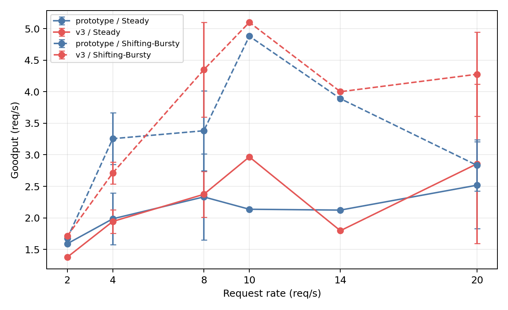
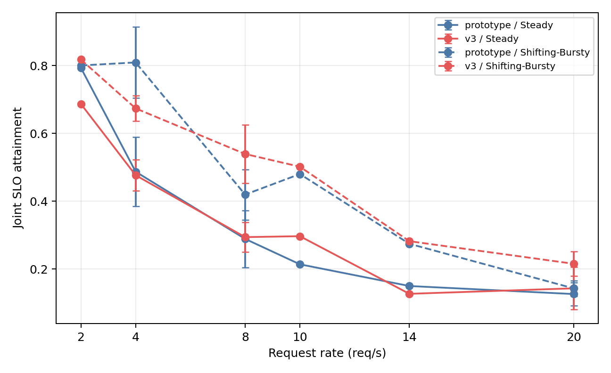
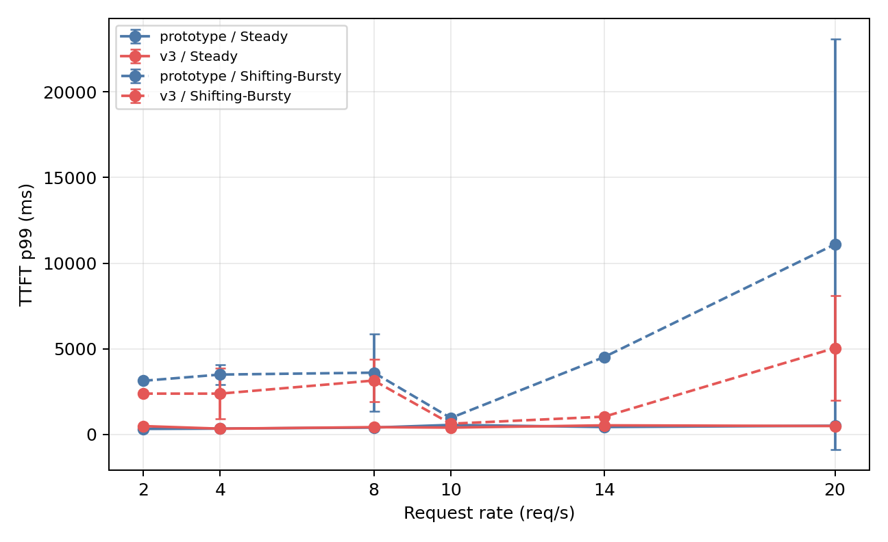
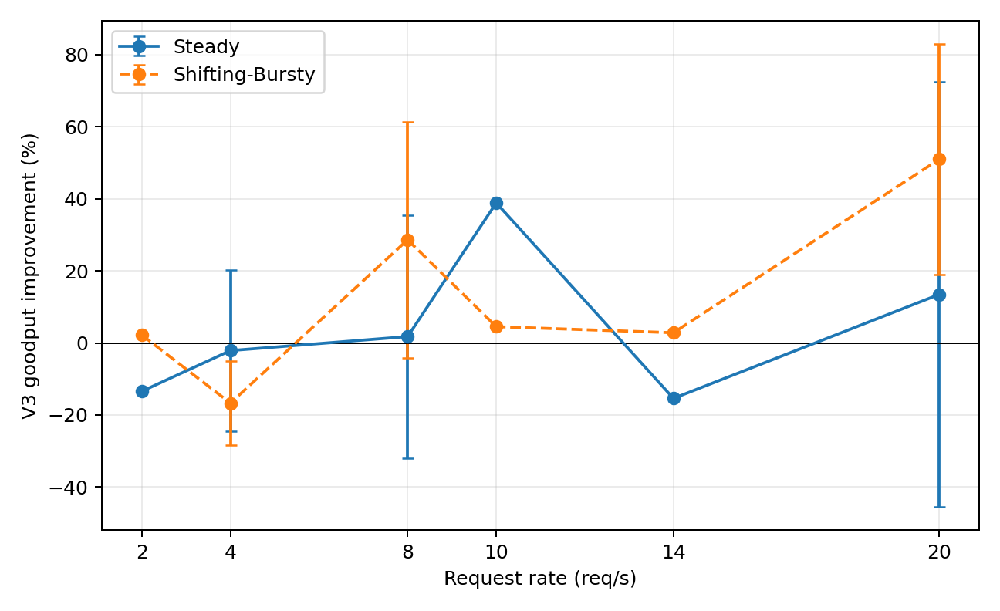

# Paper-Faithful V3 Validation

| Workload | Rate | Prototype goodput | V3 goodput | Improvement | Prototype joint SLO | V3 joint SLO |
|---|---:|---:|---:|---:|---:|---:|
| Steady | 2 | 1.590 | 1.377 | -13.4% | 0.794 | 0.687 |
| Steady | 4 | 1.986 ± 0.412 | 1.943 ± 0.186 | -2.1% | 0.487 ± 0.102 | 0.477 ± 0.046 |
| Steady | 8 | 2.332 ± 0.684 | 2.373 ± 0.363 | +1.8% | 0.289 ± 0.084 | 0.294 ± 0.044 |
| Steady | 10 | 2.137 | 2.967 | +38.8% | 0.214 | 0.297 |
| Steady | 14 | 2.123 | 1.797 | -15.4% | 0.150 | 0.127 |
| Steady | 20 | 2.518 ± 0.688 | 2.857 ± 1.262 | +13.5% | 0.126 ± 0.034 | 0.143 ± 0.062 |
| Shifting-Bursty | 2 | 1.673 | 1.710 | +2.2% | 0.801 | 0.818 |
| Shifting-Bursty | 4 | 3.256 ± 0.409 | 2.712 ± 0.172 | -16.7% | 0.810 ± 0.105 | 0.674 ± 0.037 |
| Shifting-Bursty | 8 | 3.381 ± 0.633 | 4.348 ± 0.750 | +28.6% | 0.419 ± 0.074 | 0.539 ± 0.087 |
| Shifting-Bursty | 10 | 4.880 | 5.100 | +4.5% | 0.480 | 0.502 |
| Shifting-Bursty | 14 | 3.890 | 4.000 | +2.8% | 0.274 | 0.282 |
| Shifting-Bursty | 20 | 2.833 ± 0.407 | 4.277 ± 0.666 | +50.9% | 0.143 ± 0.023 | 0.215 ± 0.036 |

## 핵심 질문

1. 2–4 req/s 정상성: 위 표 및 Goodput/SLO 그래프 기준.
2. 8–10 req/s SLO knee: Joint SLO 및 TTFT p99 그래프 기준.
3. 20 req/s Shifting-Bursty 재현: V3 goodput 개선 +50.9% (각 arm n=3).
4. workload별 이점: Improvement 그래프의 Steady/ Shifting-Bursty 곡선 비교.

## Figures

