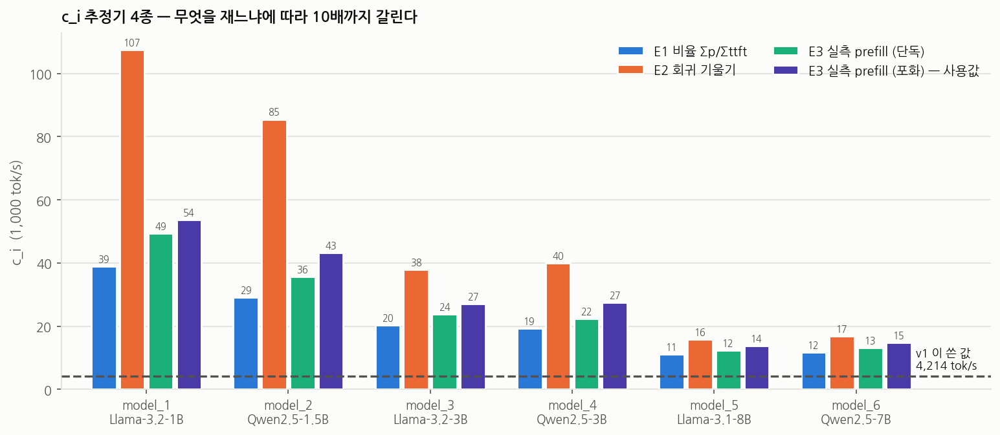
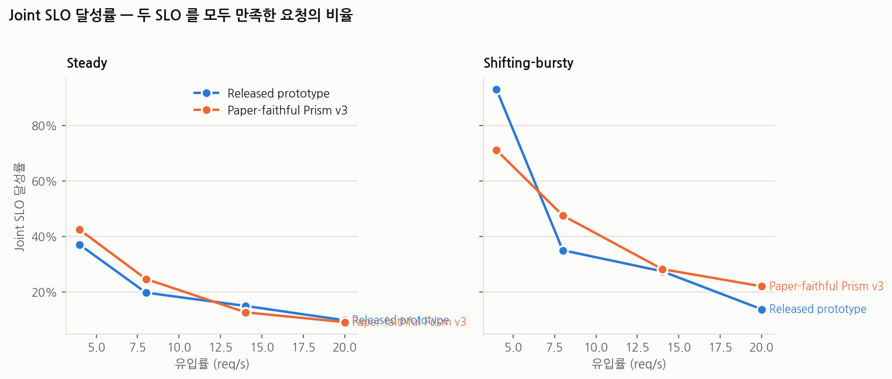
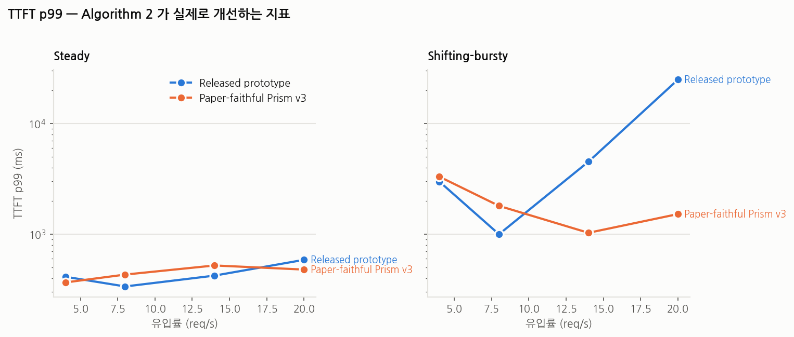

# Paper-Faithful Prism v3 — Released Prototype 비교

_`exp/scripts/build_report_v2.py` 가 생성. 하네스 커밋 `3ff64a0`._

## 0. 비교 범위

이 보고서는 동일한 6개 모델, A100 80GB 2장, 동일한 paired request set과 평균 offered load에서
`released-prototype`과 `paper-faithful-v3`를 비교한다. 워크로드는 steady와 shifting-bursty,
aggregate 요청률은 4/8/14/20 req/s이며 각 점은 seed 1의 300초 측정 구간이다.

v3는 Algorithm 1 line 8의 절대 `tau` 판정, 초기 모델 병렬 로딩, target-first overlap
migration, GPU 로컬 Moore-Hodgson admission을 함께 활성화한다.

모델 프로파일과 sanity/calibration은 같은 장비·모델·SLO 설정으로 직전에 수행한 v2
결과를 재사용하고, 본 비교의 16개 측정 런은 v3 결과 디렉터리에 별도로 기록한다.

## 1. 실험 환경

| 항목 | 값 |
| --- | --- |
| GPU | 2 x NVIDIA A100-SXM4-80GB, 81920 MiB |
| Driver | 570.211.01 |
| CPU | AMD EPYC 7513 32-Core Processor |
| RAM | 1385 GiB |
| OS | Linux 5.15.0-186-generic |
| CUDA (torch) | 12.1 |
| torch | 2.4.0+cu121 |
| SGLang (prism-research fork) | 0.3.4.post2 |
| prism-research commit | 595ec1f170e75a43897a7a2ad58ac5a9820aa2e8 |
| kvcached commit (prism/shm) | d78649d0c2b7d2ff32eb48a423df7bf60054f4c9 |
| Prism harness branch | exp/paper-faithful-v3 |
| Prism harness commit | 3ff64a0f2255dd9f89ea0313410ac339753d85db |

## 2. 모델

| 슬롯 | 모델 | 파라미터 | dtype | 가중치 (GiB) | KV cell (B/token) | TTFT p95 (ms) | TPOT p95 (ms) |
| --- | --- | --- | --- | ---: | ---: | ---: | ---: |
| model_1 | `meta-llama/Llama-3.2-1B` | 1.24B | bf16 | 2.28 | 32768 | 24.6 | 7.11 |
| model_2 | `Qwen/Qwen2.5-1.5B-Instruct` | 1.54B | bf16 | 3.01 | 28672 | 33.5 | 11.08 |
| model_3 | `meta-llama/Llama-3.2-3B` | 3.21B | bf16 | 6.00 | 114688 | 57.4 | 12.43 |
| model_4 | `Qwen/Qwen2.5-3B-Instruct` | 3.09B | bf16 | 5.84 | 36864 | 56.7 | 15.66 |
| model_5 | `meta-llama/Llama-3.1-8B` | 8.03B | bf16 | 15.08 | 131072 | 116.7 | 12.97 |
| model_6 | `Qwen/Qwen2.5-7B-Instruct` | 7.62B | bf16 | 14.28 | 57344 | 105.3 | 12.62 |

KV cell size 가 파라미터 수와 **단조가 아니도록** 일부러 골랐다. `model_3` 은 같은 크기의 `model_4` 보다 토큰당 KV 를 3.1배, `model_5` 는 `model_6` 보다 2.3배 쓴다. 이렇게 하지 않으면 KVPR 이 상주 가중치의 재라벨링으로 퇴화해 Algorithm 1 의 목적함수가 평평해진다 — v1 의 3 x Llama-3.1-8B 구성에서 실제로 그랬다.
TTFT/TPOT p95 는 이 장비에서 잰 무경합 단독 측정값이다(논문 §7.1 방식). 아래에서 쓰는 SLO 는 이 값에 스케일을 곱한 것이다.

## 3. v3 구현 및 실행 설정

| 항목 | v3 설정 | 런타임 증거 |
| --- | --- | --- |
| Algorithm 1 line 8 | `current_r - best_r > tau`, absolute tau; KV bytes를 GiB로 정규화 | `server.log.global_controller.log`의 `[PAPER-ALG1-V3]` JSON |
| 초기 로딩 | GPU별 모델을 병렬 활성화 | `--parallel-model-loading` |
| 마이그레이션 | target 활성화 완료 후 source 비활성화 | action 로그의 `ActivateAction` → `DeactivateAction` |
| 제어 경합 방지 | 응답 waiter 선등록, 활성화 직렬화, worker-slot 예약 검사, 600초 readiness timeout, 부분 성공 시 안전한 source 정리 | timeout/assert/worker 부족이 없는 최종 run의 controller/stdout 로그 |
| 로컬 admission | Moore-Hodgson | GPU scheduler 로그의 `[PAPER-ALG2] enabled=True` |
| 비교 페어링 | 같은 trace, seed, duration, SLO scale | `META.txt`, paired request/phase JSON, canonical run 경로 |

요청 실패가 발생한 시도는 한 번 자동 재실행한다. 재시도에서 회복되면
`RECOVERED_AFTER_RETRY`, 다시 발생하면 `REPRODUCED_REQUEST_FAILURE`로 표시하며,
재현된 실패는 시스템 결과로 보존하고 달성률/goodput의 분모에 포함한다.
응답 waiter 등록 경합이 있던 구현으로 수행된 진단 시도는 `*_invalid_response_race_*`로
보존하되 정규 seed 집계에서 제외하고, 수정 코드로 다시 측정했다.
또한 메모리만 보고 이미 worker 4개가 찬 GPU를 재활성화 대상으로 고르던 진단 시도는
정규 결과에서 제외했다. 최종 구현은 현재 active instance와 같은 scheduling cycle에서
예약된 target slot을 함께 계산하며, 수정 코드로 14/20 req/s를 다시 측정했다.

### c_i 추정기 (tokens/s)

*추정기에 따라 최대 10배까지 갈린다. Algorithm 2 에 넣는 값은 포화 상태의 총 prefill 처리량(E3sat)이다.*

| 슬롯 | E1 비율 Σp/Σttft | E2 회귀 기울기 | E2 절편 (ms) | E3 실측 prefill, 단독 | E3 실측 prefill, 포화 | **사용값** |
| --- | ---: | ---: | ---: | ---: | ---: | ---: |
| model_1 | 38925 | 107492 | 9.9 | 49408 | 53634 | **53634** |
| model_2 | 29176 | 85487 | 13.5 | 35700 | 43242 | **43242** |
| model_3 | 20293 | 37875 | 13.8 | 23752 | 27057 | **27057** |
| model_4 | 19258 | 39910 | 16.1 | 22419 | 27414 | **27414** |
| model_5 | 11122 | 15761 | 15.9 | 12307 | 13702 | **13702** |
| model_6 | 11670 | 16889 | 15.8 | 13203 | 14759 | **14759** |

## 4. Sanity 게이트

| 검사 | 결과 | 통과 여부 |
| --- | --- | --- |
| 0. Algorithm 1 이 실제로 실행됨 | [PAPER-ALG1] 로그 45줄 (마이그레이션 2) | PASS |
| 0. Algorithm 2 가 실제로 실행됨 | [PAPER-ALG2] 로그 2줄 | PASS |
| A. c_i 예측 대 실측 prefill | 예측/실측 중앙값 0.071 (n=1619). 모델별 model_1:0.06, model_2:0.06, model_3:0.04, model_4:0.11, model_5:0.13, model_6:0.12. e_i 는 배치로 함께 처리된 요청 하나의 몫이므로 벽시계 구간보다 작은 것이 정상이며, 자릿수 오류만 잡는 검사다 | PASS |
| B. Algorithm 2 과소 수용 | pathological 라운드 0/479, eligible>0 이면서 selected=0 인 최대 연속 0회, selected/eligible=0.940 | PASS |
| B2. Algorithm 2 선택 비율 | selected/eligible=0.940 | PASS |
| C. GPU 유휴인데 큐 증가 | GPU 사용률<20% 이면서 큐>20 인 샘플 0/95 | PASS |
| D. KVPR 이 시간에 따라 변함 | peak KVPR 변동계수 0.353 (42사이클, 최소 2.41e+05, 최대 1.11e+08) | PASS |
| E. GPU 후보 간 KVPR 분리 | 사이클별 GPU 간 (max-min)/max KVPR 평균 0.597 | PASS |
| F. 스케줄러가 실제로 동작 | 마이그레이션 4, 활성화 4, 유휴 축출 4 | PASS |
| G. 지연 지표 정합성 | TTFT n=1619 p50=57.4ms p99=4073.7ms, TPOT n=1619 p50=23.92ms p99=70.84ms | PASS |
| H. 워크로드 재현성 | bursty_r8_s77.pkl: 원본 db0726e69b23 대 재생성 db0726e69b23 (SHA256) | PASS |

Hard 실패: **0건** — 게이트 통과, 본 실험 진행됨.

### 부하 calibration (released prototype, steady, 짧은 런)

*처리율은 끝까지 유입률을 따라간다. 무너지는 것은 달성률뿐이므로 이 실험 구간은 용량 포화가 아니라 SLO 바운드다.*

| 유입률 (req/s) | 처리율 | TTFT p50 (ms) | TTFT p99 (ms) | TPOT p50 (ms) | Joint 달성률 | Goodput | 최대 큐 |
| ---: | ---: | ---: | ---: | ---: | ---: | ---: | ---: |
| 1 | 1.07 | 62.9 | 287.0 | 21.6 | 0.980 | 1.05 | 0 |
| 2 | 2.20 | 74.7 | 250.8 | 28.3 | 0.841 | 1.85 | 0 |
| 3 | 3.41 | 75.6 | 330.2 | 29.1 | 0.866 | 2.96 | 0 |
| 5 | 5.20 | 77.0 | 343.4 | 31.6 | 0.687 | 3.57 | 0 |
| 8 | 8.23 | 80.3 | 331.8 | 38.0 | 0.425 | 3.50 | 0 |
| 10 | 9.95 | 84.9 | 342.1 | 41.8 | 0.371 | 3.69 | 0 |

## 5. 워크로드

| 유입률 (req/s) | 길이 (s) | Seed | 총 요청 | 평균 offered load | model_1 | model_2 | model_3 | model_4 | model_5 | model_6 |
| ---: | ---: | ---: | ---: | ---: | ---: | ---: | ---: | ---: | ---: | ---: |
| 10 | 420 | 1 | 4240 | 10.10 | 319 | 637 | 940 | 472 | 1190 | 682 |
| 14 | 420 | 1 | 5978 | 14.23 | 429 | 903 | 1359 | 646 | 1736 | 905 |
| 1 | 420 | 1 | 442 | 1.05 | 37 | 66 | 97 | 51 | 125 | 66 |
| 20 | 420 | 1 | 8423 | 20.05 | 640 | 1227 | 1904 | 947 | 2410 | 1295 |
| 2 | 420 | 1 | 858 | 2.04 | 60 | 138 | 200 | 94 | 237 | 129 |
| 4 | 420 | 1 | 1736 | 4.13 | 136 | 267 | 393 | 170 | 486 | 284 |
| 8 | 420 | 1 | 3387 | 8.06 | 238 | 509 | 777 | 379 | 973 | 511 |

### Shifting Bursty

- 위상 길이 범위: 30~90 초 (랜덤, seed 고정)
- hot set 크기: 1~3개 모델, 위상마다 다시 뽑음
- 유입률 배수: HOT [3.0, 6.0], MEDIUM [0.8, 1.5], LOW [0.1, 0.4], IDLE = 0
- 기본 비중: {'model_1': 1.0, 'model_2': 1.0, 'model_3': 1.5, 'model_4': 1.5, 'model_5': 2.5, 'model_6': 2.5}
- seed: 1
- **집계 유입률은 모든 위상에서 같은 상수로 정규화된다.** 따라서 클러스터가 받는 총 부하는 전혀 움직이지 않고, 바뀌는 것은 *어느 모델이* hot 인가뿐이다. '클러스터가 더 바빠졌다' 를 교란변수에서 제거하고, Prism 이 이용한다고 주장하는 효과만 남긴다.

### Steady

- 모델별 요청 수를 bursty 트레이스에서 그대로 가져옴
- 각 모델의 도착을 전체 구간에 균등 난수로 배치 (N 개 균등 점 = 개수를 N 으로 조건화한 균질 포아송 과정)

### 두 워크로드에서 동일한 것

| 속성 | Bursty | Steady |
| --- | --- | --- |
| Request set | 동일 | 동일 |
| 프롬프트 | 동일 | 동일 |
| 모델 배정 | 동일 | 동일 |
| 출력 길이 | 동일 | 동일 |
| 모델별 요청 수 | 동일 | 동일 |
| 총 요청 수 | 동일 | 동일 |
| 실험 길이 | 동일 | 동일 |
| 평균 offered load | 동일 | 동일 |
| Random seed | 동일 | 동일 |
| **도착 타이밍** | **Bursty** | **Uniform** |

## 6. 결과

*부하별 Joint SLO 달성률. 왼쪽이 steady, 오른쪽이 shifting-bursty.*

*TTFT p99 (로그 축). Algorithm 2 가 실제로 개선하는 지표.*

### 유입률 4 req/s

| 시스템 | 워크로드 | 요청 (완료/실패) | TTFT p50 | TTFT p95 | TTFT p99 | TPOT p50 | TPOT p95 | TPOT p99 | TTFT 달성률 | TPOT 달성률 | Joint 달성률 | 처리율 | Goodput | 마이그 | 활성화 | 축출 | 최대 큐 |
| --- | --- | ---: | ---: | ---: | ---: | ---: | ---: | ---: | ---: | ---: | ---: | ---: | ---: | ---: | ---: | ---: | ---: |
| paper-faithful-v3 | bursty | 1204/0 | 70.9 | 224.8 | 3308.3 | 27.7 | 53.5 | 72.9 | 0.963 | 0.739 | 0.710 | 4.01 | 2.85 | 14 | 6 | 7 | 12 |
| released-prototype | bursty | 1204/0 | 58.3 | 220.4 | 2988.4 | 24.6 | 37.2 | 64.1 | 0.971 | 0.955 | 0.929 | 4.01 | 3.73 | 4 | 6 | 7 | 0 |
| paper-faithful-v3 | steady | 1224/0 | 92.4 | 230.2 | 366.3 | 38.7 | 59.6 | 73.5 | 0.965 | 0.438 | 0.424 | 4.08 | 1.73 | 14 | 0 | 0 | 4 |
| released-prototype | steady | 1224/0 | 90.4 | 242.7 | 412.3 | 38.5 | 58.0 | 75.4 | 0.958 | 0.380 | 0.370 | 4.08 | 1.51 | 0 | 0 | 0 | 0 |

### 유입률 8 req/s

| 시스템 | 워크로드 | 요청 (완료/실패) | TTFT p50 | TTFT p95 | TTFT p99 | TPOT p50 | TPOT p95 | TPOT p99 | TTFT 달성률 | TPOT 달성률 | Joint 달성률 | 처리율 | Goodput | 마이그 | 활성화 | 축출 | 최대 큐 |
| --- | --- | ---: | ---: | ---: | ---: | ---: | ---: | ---: | ---: | ---: | ---: | ---: | ---: | ---: | ---: | ---: | ---: |
| paper-faithful-v3 | bursty | 2412/0 | 88.9 | 315.7 | 1802.2 | 37.1 | 81.2 | 127.9 | 0.945 | 0.498 | 0.475 | 8.04 | 3.82 | 14 | 6 | 7 | 11 |
| released-prototype | bursty | 2412/0 | 87.7 | 275.3 | 998.2 | 42.2 | 79.1 | 104.4 | 0.963 | 0.369 | 0.350 | 8.04 | 2.81 | 2 | 6 | 7 | 0 |
| paper-faithful-v3 | steady | 2412/0 | 96.7 | 235.7 | 431.5 | 43.0 | 75.7 | 105.2 | 0.958 | 0.254 | 0.247 | 8.04 | 1.98 | 13 | 0 | 0 | 4 |
| released-prototype | steady | 2412/0 | 95.6 | 227.4 | 337.0 | 42.6 | 60.8 | 69.2 | 0.970 | 0.206 | 0.197 | 8.04 | 1.59 | 0 | 0 | 0 | 0 |

### 유입률 14 req/s

| 시스템 | 워크로드 | 요청 (완료/실패) | TTFT p50 | TTFT p95 | TTFT p99 | TPOT p50 | TPOT p95 | TPOT p99 | TTFT 달성률 | TPOT 달성률 | Joint 달성률 | 처리율 | Goodput | 마이그 | 활성화 | 축출 | 최대 큐 |
| --- | --- | ---: | ---: | ---: | ---: | ---: | ---: | ---: | ---: | ---: | ---: | ---: | ---: | ---: | ---: | ---: | ---: |
| paper-faithful-v3 | bursty | 4256/0 | 100.2 | 419.9 | 1028.9 | 52.4 | 182.4 | 433.7 | 0.936 | 0.288 | 0.282 | 14.19 | 4.00 | 14 | 6 | 7 | 29 |
| released-prototype | bursty | 4256/0 | 106.7 | 566.0 | 4518.4 | 53.2 | 156.3 | 252.6 | 0.914 | 0.298 | 0.274 | 14.19 | 3.89 | 3 | 6 | 7 | 5 |
| paper-faithful-v3 | steady | 4258/0 | 110.2 | 281.2 | 521.5 | 54.9 | 114.8 | 147.8 | 0.949 | 0.133 | 0.127 | 14.19 | 1.80 | 14 | 0 | 0 | 7 |
| released-prototype | steady | 4258/0 | 102.3 | 267.2 | 422.4 | 49.8 | 100.9 | 121.3 | 0.961 | 0.157 | 0.150 | 14.19 | 2.12 | 0 | 0 | 0 | 0 |

### 유입률 20 req/s

| 시스템 | 워크로드 | 요청 (완료/실패) | TTFT p50 | TTFT p95 | TTFT p99 | TPOT p50 | TPOT p95 | TPOT p99 | TTFT 달성률 | TPOT 달성률 | Joint 달성률 | 처리율 | Goodput | 마이그 | 활성화 | 축출 | 최대 큐 |
| --- | --- | ---: | ---: | ---: | ---: | ---: | ---: | ---: | ---: | ---: | ---: | ---: | ---: | ---: | ---: | ---: | ---: |
| paper-faithful-v3 | bursty | 6056/0 | 102.0 | 607.5 | 1519.1 | 55.3 | 237.0 | 1138.0 | 0.911 | 0.225 | 0.220 | 20.19 | 4.44 | 14 | 6 | 7 | 16 |
| released-prototype | bursty | 6056/0 | 135.1 | 916.1 | 24883.5 | 76.8 | 383.5 | 714.5 | 0.847 | 0.147 | 0.137 | 20.19 | 2.77 | 7 | 6 | 7 | 11 |
| paper-faithful-v3 | steady | 6012/0 | 114.1 | 291.1 | 479.0 | 70.3 | 130.6 | 203.8 | 0.956 | 0.097 | 0.091 | 20.04 | 1.82 | 13 | 0 | 0 | 4 |
| released-prototype | steady | 6012/0 | 116.9 | 311.4 | 586.5 | 60.3 | 183.1 | 247.8 | 0.949 | 0.103 | 0.098 | 20.04 | 1.96 | 0 | 0 | 0 | 0 |

지연은 ms, 처리율과 goodput 은 req/s. Joint 달성률 = 측정 구간 요청 중 TTFT 와 TPOT SLO 를 **둘 다** 만족한 비율. Goodput = 그 요청 수 / 측정 구간 길이.

## 7. Steady vs Bursty Comparison

Relative improvement of each paper arm over `released-prototype` at the same workload and load. Positive = the paper arm wins.

| System | Workload | Rate | Joint att (base) | Joint att (paper) | dpp | Joint rel | Goodput rel | TTFT p99 rel | TPOT p99 rel |
| --- | --- | ---: | ---: | ---: | ---: | ---: | ---: | ---: | ---: |
| paper-faithful-v3 | bursty | 4 | 0.929 | 0.710 | -21.8 | -23.5% | -23.5% | -10.7% | -13.8% |
| paper-faithful-v3 | steady | 4 | 0.370 | 0.424 | +5.4 | +14.6% | +14.6% | +11.2% | +2.6% |
| paper-faithful-v3 | bursty | 8 | 0.350 | 0.475 | +12.5 | +35.8% | +35.8% | -80.6% | -22.4% |
| paper-faithful-v3 | steady | 8 | 0.197 | 0.247 | +4.9 | +25.0% | +25.0% | -28.1% | -52.0% |
| paper-faithful-v3 | bursty | 14 | 0.274 | 0.282 | +0.8 | +2.8% | +2.8% | +77.2% | -71.7% |
| paper-faithful-v3 | steady | 14 | 0.150 | 0.127 | -2.3 | -15.4% | -15.4% | -23.5% | -21.8% |
| paper-faithful-v3 | bursty | 20 | 0.137 | 0.220 | +8.3 | +60.2% | +60.2% | +93.9% | -59.3% |
| paper-faithful-v3 | steady | 20 | 0.098 | 0.091 | -0.7 | -7.0% | -7.0% | +18.3% | +17.7% |

## 8. 결론

한 문장으로 요약하면, v3는 **shifting-bursty의 중·고부하에서 released prototype보다
유리했지만 모든 부하와 steady에서 일관되게 우세하지는 않았다.** 모든 정규 런은 요청
실패 0건으로 끝났고, 비교한 8개 workload-rate 점 중 Joint SLO 달성률은 5개 점에서
높았다.

- Bursty에서는 8/14/20 req/s에서 Joint 달성률이 각각 +12.5/+0.8/+8.3%p였고,
  goodput은 +35.8%/+2.8%/+60.2%였다. 특히 20 req/s TTFT p99는 24.88초에서
  1.52초로 93.9% 감소했다.
- Bursty 4 req/s에서는 반대로 Joint 달성률과 goodput이 23.5% 낮았다. 네 부하의
  goodput 합은 v3 15.11 req/s, prototype 13.20 req/s로 v3가 14.5% 높지만, 낮은
  부하의 회귀를 감추지 않고 함께 봐야 한다.
- Steady에서는 4/8 req/s가 +5.4/+4.9%p, 14/20 req/s가 -2.3/-0.7%p였다.
  네 부하의 goodput 합은 7.33 대 7.18 req/s(+2.1%)로 차이가 작다. v3가 steady에서도
  매 런 13~14회 migration을 수행한 반면 prototype은 0회였다는 점은 고부하 steady의
  손실이 동적 제어 비용과 양립하는 결과임을 보여 주지만, 본 실험만으로 인과를 확정할
  수는 없다.
- Bursty 14/20 req/s에서 TTFT tail은 크게 개선됐지만 TPOT p99는 악화됐다. 그럼에도
  TPOT 달성률과 Joint 달성률은 높아졌으므로, v3의 이득은 최악 1% TPOT을 줄이는 것보다
  더 많은 요청을 SLO 경계 안으로 넣는 형태다.

따라서 이 결과가 지지하는 범위는 “v3의 paper-faithful 제어가 모델별 hot set이 이동하는
중·고부하에서 유효하다”까지다. “모든 부하 패턴에서 prototype을 지배한다”는 결론은
지지하지 않는다.

## 9. 해석상의 한계

- 각 점은 seed 1 한 번의 측정이다. paired request set은 시스템 간 비교 잡음을 줄이지만,
  run-to-run 분산이나 신뢰구간을 대신하지 않는다.
- 모델 프로파일과 sanity/calibration은 동일 장비에서 직전에 수행한 v2 결과를 재사용했다.
- 결과는 A100 80GB 2장, 6개 모델, 300초 측정 구간과 본 SLO scale에 한정된다.
- 최종 16개 정규 런만 표와 그림에 포함했다. 응답 waiter 경합 및 worker-slot 초과 예약을
  찾는 데 사용한 진단 실행은 수정 전 구현의 결과이므로 별도 보관하고 집계에서 제외했다.
- Algorithm 1, overlap migration, Moore-Hodgson을 함께 켠 시스템 비교이므로 각 구성 요소의
  독립 효과를 분리하려면 추가 ablation이 필요하다.
