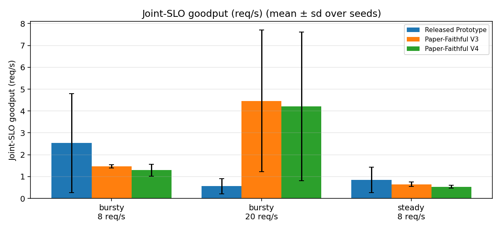
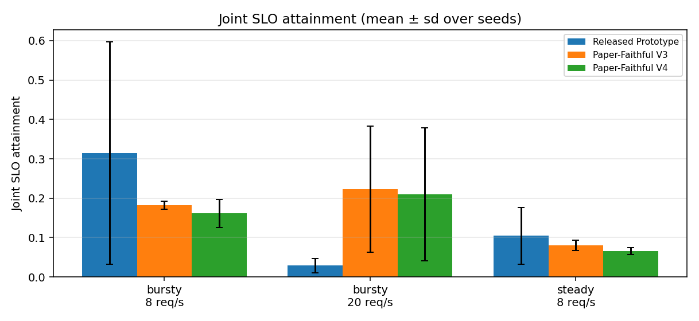
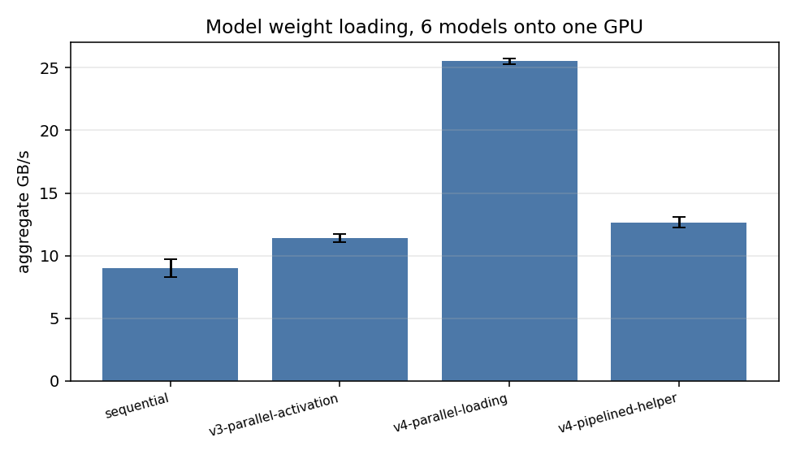
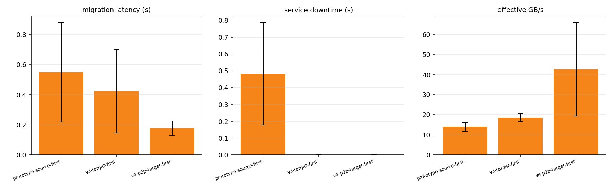

# Paper-Faithful Prism V4 — 측정 보고서

_`exp/scripts/build_report_v4.py` 가 이 디렉터리의 raw data 로부터 생성._

## 0. 실험 환경

**2×A100 allocation on a 4×A100 node.** 할당된 GPU 는 0,1 두 장뿐이며 GPU 2,3 은
어떤 프로세스에도 노출되지 않는다 (`CUDA_VISIBLE_DEVICES=0,1`).
각 런의 `gpu_timeline.txt` 는 네 장 모두를 2 초 간격으로 샘플링하므로,
나머지 두 장이 유휴였다는 것은 주장이 아니라 raw data 로 남는다.

```
gpu_pair=0,1
index, name, memory.total [MiB], compute_cap, driver_version
0, NVIDIA A100-SXM4-80GB, 81920 MiB, 8.0, 580.105.08
1, NVIDIA A100-SXM4-80GB, 81920 MiB, 8.0, 580.105.08
2, NVIDIA A100-SXM4-80GB, 81920 MiB, 8.0, 580.105.08
3, NVIDIA A100-SXM4-80GB, 81920 MiB, 8.0, 580.105.08
--- topology
	GPU0	GPU1	GPU2	GPU3	NIC0	CPU Affinity	NUMA Affinity	GPU NUMA ID
GPU0	 X 	NV12	NV12	NV12	SYS	32-63,96-127	1		N/A
GPU1	NV12	 X 	NV12	NV12	SYS	32-63,96-127	1		N/A
GPU2	NV12	NV12	 X 	NV12	SYS	32-63,96-127	1		N/A
GPU3	NV12	NV12	NV12	 X 	SYS	32-63,96-127	1		N/A
NIC0	SYS	SYS	SYS	SYS	 X 				

Legend:

  X    = Self
  SYS  = Connection traversing PCIe as well as the SMP interconnect between NUMA nodes (e.g., QPI/UPI)
  NODE = Connection traversing PCIe as well as the interconnect between PCIe Host Bridges within a NUMA node
  PHB  = Connection traversing PCIe as well as a PCIe Host Bridge (typically the CPU)
  PXB  = Connection traversing multiple PCIe bridges (without traversing the PCIe Host Bridge)
  PIX  = Connection traversing at most a single PCIe bridge
  NV#  = Connection traversing a bonded set of # NVLinks

NIC Legend:

  NIC0: rocep49s0

--- nvlink
GPU 0: NVIDIA A100-SXM4-80GB (UUID: GPU-e04968e9-3302-841c-b00f-f388d7a8f56f)
	 Link 0: 25 GB/s
	 Link 1: 25 GB/s
	 Link 2: 25 GB/s
	 Link 3: 25 GB/s
	 Link 4: 25 GB/s
	 Link 5: 25 GB/s
	 Link 6: 25 GB/s
	 Link 7: 25 GB/s
	 Link 8: 25 GB/s
	 Link 9: 25 GB/s
	 Link 10: 25 GB/s
	 Link 11: 25 GB/s
GPU 1: NVIDIA A100-SXM4-80GB (UUID: GPU-fd26179c-de1f-3f6f-f298-383b36269b35)
	 Link 0: 25 GB/s
	 Link 1: 25 GB/s
	 Link 2: 25 GB/s
	 Link 3: 25 GB/s
	 Link 4: 25 GB/s
	 Link 5: 25 GB/s
	 Link 6: 25 GB/s
	 Link 7: 25 GB/s
	 Link 8: 25 GB/s
	 Link 9: 25 GB/s
	 Link 10: 25 GB/s
	 Link 11: 25 GB/s
GPU 2: NVIDIA A100-SXM4-80GB (UUID: GPU-60619e5a-d4b4-3305-17ff-190a5474ada5)
	 Link 0: 25 GB/s
	 Link 1: 25 GB/s
	 Link 2: 25 GB/s
	 Link 3: 25 GB/s
	 Link 4: 25 GB/s
	 Link 5: 25 GB/s
	 Link 6: 25 GB/s
	 Link 7: 25 GB/s
	 Link 8: 25 GB/s
	 Link 9: 25 GB/s
	 Link 10: 25 GB/s
	 Link 11: 25 GB/s
GPU 3: NVIDIA A100-SXM4-80GB (UUID: GPU-ca841b49-69a5-890b-d980-1bd4f98161d8)
	 Link 0: 25 GB/s
	 Link 1: 25 GB/s
	 Link 2: 25 GB/s
	 Link 3: 25 GB/s
	 Link 4: 25 GB/s
	 Link 5: 25 GB/s
	 Link 6: 25 GB/s
	 Link 7: 25 GB/s
	 Link 8: 25 GB/s
	 Link 9: 25 GB/s
	 Link 10: 25 GB/s
	 Link 11: 25 GB/s
--- cpu
CPU(s):                               128
Model name:                           AMD EPYC 7532 32-Core Processor
CPU(s) scaling MHz:                   70%
NUMA node(s):                         2
--- free
               total        used  
```

이전 V3 보고서는 **다른 장비**에서 측정되었다. 그래서 이 연구는 released prototype 과
V3 를 여기서 다시 돌린다. 이 보고서 안의 arm 간 비교만 유효하며, 이전 V3 보고서의
절대 수치와 직접 비교해서는 안 된다. 자세한 차이는 `provenance/ENVIRONMENT.md`.

## 1. Microbenchmark — 병렬 가중치 로딩

모델 6개(총 46.05 GiB)를 GPU 0 으로 로드. 각 arm 3회.
peer access: `{'0->1': True, '1->0': True}`

| Arm | 총 로딩 시간 (s) | 대역폭 (GB/s) | H2D direct (GiB) | H2D helper (GiB) | P2P (GiB) | 경로 |
| --- | ---: | ---: | ---: | ---: | ---: | --- |
| sequential | 5.509 ± 0.418 | 9.01 ± 0.72 | 46.05 | 0.00 | 0.00 | host-to-device-only |
| v3-parallel-activation | 4.345 ± 0.129 | 11.39 ± 0.34 | 23.03 | 23.03 | 23.03 | host-to-device + helper-gpu-p2p |
| v4-parallel-loading | 1.938 ± 0.016 | 25.51 ± 0.21 | 23.03 | 23.03 | 23.03 | host-to-device + helper-gpu-p2p |
| v4-pipelined-helper | 3.907 ± 0.127 | 12.67 ± 0.41 | 23.03 | 23.03 | 23.03 | host-to-device + helper-gpu-p2p |

V3 는 sequential 대비 **1.26배**, V4 는 V3 대비 **2.24배**, sequential 대비 **2.83배**.

바이트 분할은 세 arm 이 동일하다 — 즉 이득은 옮긴 양이 아니라 **어떻게** 옮겼는지에서
온다. V3 가 sequential 을 이기는 것은 두 번째 PCIe 링크를 쓰기 때문이고, V4 가
V3 를 이기는 것은 공유 호스트 페이지를 제자리에서 page-lock 해 드라이버 bounce
buffer 경유가 실제 DMA 가 되기 때문이다. 두 메커니즘 모두 논문 §5.3 의 의도에 있다.

helper leg 파이프라이닝(ablation)은 12.67 GB/s 로 V4 기본 경로보다 느렸다. sub-chunk 마다 드는 event 비용이 겹침으로
얻는 것보다 컸다. 구현은 남기되 기본 경로로 쓰지 않는다.

| Arm | Qwen/Qwen2.5-1.5B-Instruct | Qwen/Qwen2.5-3B-Instruct | Qwen/Qwen2.5-7B-Instruct | meta-llama/Llama-3.1-8B | meta-llama/Llama-3.2-1B | meta-llama/Llama-3.2-3B |
| --- | ---: | ---: | ---: | ---: | ---: | ---: |
| sequential | 0.335 | 0.656 | 1.609 | 1.689 | 0.517 | 0.696 |
| v3-parallel-activation | 4.238 | 4.339 | 4.231 | 4.014 | 2.407 | 3.568 |
| v4-parallel-loading | 1.928 | 1.929 | 1.927 | 1.925 | 1.928 | 1.929 |
| v4-pipelined-helper | 3.681 | 3.702 | 3.718 | 3.514 | 2.303 | 3.450 |

_모델별 전송 시간 (초, 3회 평균). **sequential 의 값이 작은 것은 빠르다는 뜻이 아니다** — 한 번에 한 모델만 옮기므로 각 모델이 링크를 독점하고, 대신 그것들이 차례로 일어나 위 표의 총 시간이 가장 길다. 나머지 arm 은 여섯 모델이 동시에 경합하므로 개별 시간은 길고 총 시간은 짧다._

## 2. Microbenchmark — 마이그레이션

GPU 0 → 1, 모델 3개 × 3회.

| Arm | latency (s) | service downtime (s) | 전송 바이트 (GiB) | 대역폭 (GB/s) | 경로 | NVLink Rx (GiB) |
| --- | ---: | ---: | ---: | ---: | --- | ---: |
| prototype-source-first | 0.550 ± 0.329 | 0.482 ± 0.303 | 7.75 | 14.0 ± 2.3 | host-to-device + helper-gpu-p2p | 3.87 |
| v3-target-first | 0.422 ± 0.277 | 0.000 | 7.75 | 18.7 ± 2.0 | host-to-device + helper-gpu-p2p | 3.87 |
| v4-p2p-target-first | 0.177 ± 0.049 | 0.000 | 7.75 | 42.5 ± 23.3 | gpu-to-gpu-p2p | 7.75 |

모델별로 나누어 보면(크기가 6.5배까지 차이나므로 평균은 효과를 가린다):

| 모델 | 크기 (GiB) | Arm | latency (s) | downtime (s) | GB/s | NVLink Rx (GiB) |
| --- | ---: | --- | ---: | ---: | ---: | ---: |
| Llama-3.2-1B | 2.30 | prototype-source-first | 0.211 ± 0.036 | 0.177 ± 0.045 | 11.9 ± 1.8 | 1.15 |
| Llama-3.2-1B | 2.30 | v3-target-first | 0.151 ± 0.001 | 0.000 | 16.4 ± 0.1 | 1.15 |
| Llama-3.2-1B | 2.30 | v4-p2p-target-first | 0.112 ± 0.002 | 0.000 | 22.0 ± 0.4 | 2.30 |
| Llama-3.2-3B | 5.98 | prototype-source-first | 0.478 ± 0.003 | 0.406 ± 0.006 | 13.4 ± 0.1 | 2.99 |
| Llama-3.2-3B | 5.98 | v3-target-first | 0.341 ± 0.008 | 0.000 | 18.8 ± 0.5 | 2.99 |
| Llama-3.2-3B | 5.98 | v4-p2p-target-first | 0.197 ± 0.007 | 0.000 | 32.6 ± 1.2 | 5.98 |
| Llama-3.1-8B | 14.96 | prototype-source-first | 0.959 ± 0.010 | 0.863 ± 0.008 | 16.7 ± 0.2 | 7.48 |
| Llama-3.1-8B | 14.96 | v3-target-first | 0.773 ± 0.034 | 0.000 | 20.8 ± 0.9 | 7.48 |
| Llama-3.1-8B | 14.96 | v4-p2p-target-first | 0.220 ± 0.005 | 0.000 | 72.9 ± 1.8 | 14.96 |

NVLink Rx 는 드라이버의 링크 카운터를 전송 직전/직후에 읽어 뺀 값이다.
broker 경로에서는 모델의 정확히 절반, P2P 경로에서는 모델 전체가 NVLink 를 건넌다 —
즉 경로는 추정이 아니라 계측되었다. PCIe 상한(약 25 GB/s)을 넘는 대역폭도 같은 결론을
독립적으로 뒷받침한다.

downtime 이 갈리는 지점은 **순서**다. prototype 은 원본을 먼저 비활성화하므로 전송
구간 전체가 서비스 공백이고, target-first 는 원본이 계속 서비스하므로 공백이 0 이다.
그리고 target-first 이기 때문에 원본 GPU 에 가중치가 아직 살아 있고, 그것이 V4 의
GPU→GPU 전송을 가능하게 하는 전제다.

## 3. TP=2 검증

**판정: FAIL**

- [FAIL] server_started
- [PASS] tp_size_2_configured
- [PASS] both_gpus_in_placement
- [NOT OBSERVED] ranks_observed_on_distinct_gpus
- [PASS] nccl_mentioned_in_logs
- [FAIL] inference_succeeded
- [FAIL] no_runtime_errors
- [FAIL] load_phase_exit_zero

startup 74.9s, TP rank → GPU: `{}`


TP=2 는 논문 범위대로 **주어진 TP 설정의 배치/스케줄링**만 검증한다. Prism 이 TP
degree 를 스스로 정하게 만드는 기능은 추가하지 않았다.

부수적으로 확인된 사실: `tp_size > 1` 이면 upstream 이 model-service 경로를 끄므로
(`model_runner.py`) **TP 모델은 병렬 가중치 로딩을 쓰지 않는다.**

## 4. End-to-End

측정 구간 300 초(워밍업 60 초 제외), seed 당 1 런. 값은 seed 간 mean ± sd.

| Workload | Rate | Arm | seeds | Goodput | Joint SLO | TTFT SLO | TPOT SLO | Throughput |
| --- | ---: | --- | ---: | ---: | ---: | ---: | ---: | ---: |
| bursty | 8 | Released Prototype | 3 | 2.532 ± 2.270 | 0.315 ± 0.282 | 0.925 ± 0.049 | 0.322 ± 0.285 | 8.05 ± 0.11 |
| bursty | 8 | Paper-Faithful V3 | 3 | 1.464 ± 0.070 | 0.182 ± 0.010 | 0.916 ± 0.014 | 0.188 ± 0.013 | 8.05 ± 0.11 |
| bursty | 8 | Paper-Faithful V4 | 3 | 1.296 ± 0.270 | 0.161 ± 0.036 | 0.885 ± 0.028 | 0.169 ± 0.036 | 8.05 ± 0.11 |
| bursty | 20 | Released Prototype | 3 | 0.564 ± 0.349 | 0.029 ± 0.018 | 0.613 ± 0.053 | 0.031 ± 0.021 | 19.89 ± 0.35 |
| bursty | 20 | Paper-Faithful V3 | 3 | 4.464 ± 3.247 | 0.223 ± 0.160 | 0.796 ± 0.126 | 0.229 ± 0.166 | 19.89 ± 0.35 |
| bursty | 20 | Paper-Faithful V4 | 3 | 4.212 ± 3.401 | 0.210 ± 0.168 | 0.798 ± 0.177 | 0.214 ± 0.170 | 19.89 ± 0.35 |
| steady | 8 | Released Prototype | 3 | 0.844 ± 0.578 | 0.105 ± 0.072 | 0.987 ± 0.003 | 0.106 ± 0.073 | 8.07 ± 0.03 |
| steady | 8 | Paper-Faithful V3 | 3 | 0.647 ± 0.107 | 0.080 ± 0.013 | 0.980 ± 0.001 | 0.081 ± 0.014 | 8.07 ± 0.03 |
| steady | 8 | Paper-Faithful V4 | 3 | 0.534 ± 0.070 | 0.066 ± 0.009 | 0.972 ± 0.003 | 0.068 ± 0.009 | 8.07 ± 0.03 |

### 4.1 지연 분포 (ms)

| Workload | Rate | Arm | TTFT p50 | p95 | p99 | TPOT p50 | p95 | p99 | E2E p50 | p95 | p99 |
| --- | ---: | --- | ---: | ---: | ---: | ---: | ---: | ---: | ---: | ---: | ---: |
| bursty | 8 | Released Prototype | 102.2 ± 26.8 | 1130.9 ± 934.1 | 4005.7 ± 2910.5 | 45.9 ± 12.4 | 140.5 ± 88.0 | 261.4 ± 189.9 | 6395.1 ± 2434.8 | 29142.1 ± 11064.5 | 41726.5 ± 19053.6 |
| bursty | 8 | Paper-Faithful V3 | 114.4 ± 2.2 | 1093.6 ± 768.3 | 3746.6 ± 3130.4 | 52.5 ± 2.7 | 125.2 ± 24.7 | 253.5 ± 101.6 | 6948.8 ± 349.3 | 29037.0 ± 1470.7 | 41075.5 ± 7359.0 |
| bursty | 8 | Paper-Faithful V4 | 118.7 ± 8.8 | 1139.6 ± 305.9 | 4810.2 ± 2111.7 | 53.4 ± 7.7 | 171.5 ± 34.9 | 636.7 ± 492.8 | 7558.7 ± 1481.0 | 31626.2 ± 5867.1 | 50888.4 ± 9640.0 |
| bursty | 20 | Released Prototype | 219.1 ± 33.8 | 4650.7 ± 752.2 | 9185.1 ± 2593.4 | 145.4 ± 29.5 | 844.2 ± 45.0 | 1790.9 ± 92.5 | 18572.8 ± 2316.8 | 83987.9 ± 8448.6 | 104740.6 ± 5337.4 |
| bursty | 20 | Paper-Faithful V3 | 134.7 ± 49.3 | 2927.0 ± 2408.9 | 8226.9 ± 5414.8 | 77.9 ± 40.8 | 565.8 ± 293.8 | 1599.3 ± 446.3 | 10834.7 ± 5210.3 | 61234.6 ± 20731.4 | 87564.1 ± 4687.0 |
| bursty | 20 | Paper-Faithful V4 | 149.7 ± 72.8 | 3932.8 ± 4737.4 | 9886.2 ± 9315.2 | 81.5 ± 40.3 | 618.7 ± 413.2 | 1605.1 ± 723.2 | 11623.8 ± 6970.8 | 57581.9 ± 17378.7 | 86217.7 ± 10437.7 |
| steady | 8 | Released Prototype | 106.5 ± 2.9 | 242.3 ± 10.4 | 439.8 ± 9.4 | 49.4 ± 2.3 | 74.7 ± 2.2 | 88.5 ± 5.0 | 6059.3 ± 519.3 | 24440.1 ± 660.6 | 27705.3 ± 797.0 |
| steady | 8 | Paper-Faithful V3 | 112.7 ± 4.2 | 273.6 ± 23.9 | 484.6 ± 36.8 | 52.0 ± 1.6 | 88.3 ± 3.7 | 106.1 ± 8.5 | 6442.7 ± 538.3 | 26497.3 ± 1945.1 | 32528.0 ± 1556.3 |
| steady | 8 | Paper-Faithful V4 | 117.3 ± 3.5 | 287.2 ± 14.7 | 603.6 ± 68.4 | 54.0 ± 2.2 | 89.5 ± 1.9 | 111.2 ± 8.4 | 6665.1 ± 554.1 | 26355.7 ± 533.2 | 32624.0 ± 1249.8 |

### 4.2 마이그레이션

`latency` 열은 컨트롤러가 마이그레이션을 결정한 시점부터 대상이 준비될 때까지다.
**released prototype 에는 readiness barrier 가 없어 제어 핸들러가 요청을 제출하는
순간 반환한다** — 그 arm 의 latency 는 가중치 전송 시간이 아니라 제출 시간이며,
`submission_only` 열이 1 인 행이 그것이다. 프로토타입의 실제 마이그레이션 비용은
§2 의 microbenchmark 가 통제된 조건에서 측정한 값이다.

| Workload | Rate | Arm | count | 결정 | submission_only | latency p50 (ms) | p95 | downtime p50 (ms) | 전송 바이트 | 대역폭 (GB/s) | P2P 전송 |
| --- | ---: | --- | ---: | ---: | ---: | ---: | ---: | ---: | ---: | ---: | ---: |
| bursty | 8 | Released Prototype | 3.7 ± 2.1 | 3.7 ± 2.1 | 1 | 9.9 ± 1.8 | 12.5 ± 2.5 | 9.9 ± 1.8 | 23.06 ± 18.34 | 8.5 ± 1.0 | 0.0 |
| bursty | 8 | Paper-Faithful V3 | 12.7 ± 0.6 | 25.3 ± 0.6 | 0 | 2143.5 ± 146.4 | 28810.5 ± 22683.7 | 0.0 | 102.64 ± 14.68 | 8.3 ± 0.8 | 0.0 |
| bursty | 8 | Paper-Faithful V4 | 14.3 ± 1.2 | 25.7 ± 0.6 | 0 | 1934.1 ± 270.2 | 30511.8 ± 14090.7 | 0.0 | 113.49 ± 22.81 | 15.2 ± 0.7 | 0.0 |
| bursty | 20 | Released Prototype | 4.0 ± 1.7 | 4.0 ± 1.7 | 1 | 8.8 ± 0.8 | 14.1 ± 4.5 | 8.8 ± 0.8 | 32.19 ± 20.91 | 8.2 ± 0.6 | 0.0 |
| bursty | 20 | Paper-Faithful V3 | 12.7 ± 0.6 | 26.3 ± 0.6 | 0 | 1866.6 ± 587.2 | 15910.6 ± 12254.3 | 0.0 | 99.49 ± 15.71 | 7.5 ± 0.7 | 0.0 |
| bursty | 20 | Paper-Faithful V4 | 13.0 | 25.3 ± 1.2 | 0 | 1418.9 ± 638.9 | 17950.5 ± 27720.4 | 0.0 | 99.03 ± 12.42 | 13.9 ± 0.7 | 0.0 |
| steady | 8 | Released Prototype | 0.0 | 0.0 | 1 | — | — | — | 0.00 | — | 0.0 |
| steady | 8 | Paper-Faithful V3 | 12.7 ± 0.6 | 26.0 ± 2.0 | 0 | 1566.6 ± 102.0 | 2162.1 ± 173.9 | 0.0 | 45.77 ± 5.90 | 6.3 ± 0.2 | 0.0 |
| steady | 8 | Paper-Faithful V4 | 13.3 ± 0.6 | 28.0 | 0 | 1773.1 ± 51.3 | 2598.0 ± 40.7 | 0.0 | 69.46 ± 16.66 | 10.8 ± 1.2 | 0.0 |

### 4.3 마이그레이션 비용의 내역 — 전송은 어디까지인가

v4 가 최적화하는 것은 가중치 전송이다. 전송이 마이그레이션 비용의 어느 정도를
차지하는지는 가정할 것이 아니라 런이 답할 수 있는 질문이므로, 제어 액션의 벽시계를
활성화·비활성화·전송으로 나누어 기록한다.

| Workload | Rate | Arm | 활성화 (회/총 s) | 비활성화 (회/총 s) | 전송 총 s | 전송 대역폭 GB/s | 제어 액션 총 s |
| --- | ---: | --- | ---: | ---: | ---: | ---: | ---: |
| bursty | 8 | Released Prototype | 11.0 ± 2.6 / 0.1 ± 0.0 | 11.7 ± 2.5 / 0.1 ± 0.0 | 18.8 ± 2.0 | 7.5 ± 0.6 | 0.2 ± 0.1 |
| bursty | 8 | Paper-Faithful V3 | 19.0 ± 1.0 / 38.7 ± 3.2 | 19.7 ± 0.6 / 118.7 ± 16.4 | 24.9 ± 0.4 | 8.5 ± 0.2 | 157.4 ± 14.4 |
| bursty | 8 | Paper-Faithful V4 | 19.7 ± 2.1 / 35.6 ± 2.7 | 20.3 ± 1.5 / 127.2 ± 19.2 | 14.2 ± 1.1 | 17.3 ± 1.0 | 162.9 ± 16.8 |
| bursty | 20 | Released Prototype | 11.0 ± 1.7 / 0.1 ± 0.0 | 12.3 ± 2.1 / 0.1 ± 0.0 | 20.3 ± 2.6 | 7.1 ± 0.8 | 0.2 ± 0.1 |
| bursty | 20 | Paper-Faithful V3 | 19.3 ± 2.3 / 34.8 ± 15.4 | 20.7 ± 2.9 / 132.9 ± 63.0 | 25.7 ± 1.4 | 8.0 ± 0.6 | 167.6 ± 78.0 |
| bursty | 20 | Paper-Faithful V4 | 18.7 ± 0.6 / 28.3 ± 12.2 | 20.0 ± 1.0 / 130.4 ± 41.5 | 14.4 ± 1.4 | 15.6 ± 0.5 | 158.8 ± 53.1 |
| steady | 8 | Released Prototype | 0.0 / 0.0 | 0.0 / 0.0 | 9.8 ± 0.1 | 5.0 ± 0.1 | 0.0 |
| steady | 8 | Paper-Faithful V3 | 12.7 ± 0.6 / 20.2 ± 0.8 | 12.7 ± 0.6 / 136.2 ± 8.6 | 16.3 ± 0.9 | 6.5 ± 0.2 | 156.4 ± 9.4 |
| steady | 8 | Paper-Faithful V4 | 14.0 / 25.6 ± 1.4 | 13.3 ± 0.6 / 159.1 ± 13.6 | 12.0 ± 0.9 | 12.0 ± 0.7 | 184.7 ± 14.2 |

**released prototype 의 액션 시간은 제출 시간이므로 이 표에서 비교 대상이 아니다**
(§4.2 참조). 비교는 v3 대 v4 다.


### 4.4 스케줄러 / Algorithm 1

| Workload | Rate | Arm | alg1 cycles | placement decisions | MIGRATE | tau 억제 | 메모리 거부 | 수렴 gap | 큐 max |
| --- | ---: | --- | ---: | ---: | ---: | ---: | ---: | ---: | ---: |
| bursty | 8 | Released Prototype | 0.0 | 0.0 | 0.0 | — | — | — | 13.7 ± 5.5 |
| bursty | 8 | Paper-Faithful V3 | 70.0 ± 3.6 | 367.7 ± 16.5 | 13.3 ± 0.6 | — | — | — | 22.7 ± 18.5 |
| bursty | 8 | Paper-Faithful V4 | 69.3 ± 3.1 | 356.3 ± 23.7 | 13.0 | 29.0 ± 2.0 | 0.0 | 1.17 ± 0.03 | 24.3 ± 14.4 |
| bursty | 20 | Released Prototype | 0.0 | 0.0 | 0.0 | — | — | — | 112.0 ± 108.6 |
| bursty | 20 | Paper-Faithful V3 | 69.3 ± 8.3 | 365.3 ± 57.1 | 13.7 ± 0.6 | — | — | — | 116.0 ± 94.3 |
| bursty | 20 | Paper-Faithful V4 | 70.7 ± 8.1 | 367.3 ± 55.6 | 13.3 ± 0.6 | 29.0 ± 9.0 | 0.0 | 1.25 ± 0.15 | 80.0 ± 70.4 |
| steady | 8 | Released Prototype | 0.0 | 0.0 | 0.0 | — | — | — | 0.0 |
| steady | 8 | Paper-Faithful V3 | 68.0 ± 2.0 | 408.0 ± 12.0 | 13.0 ± 1.0 | — | — | — | 4.3 ± 1.5 |
| steady | 8 | Paper-Faithful V4 | 63.3 ± 2.1 | 380.0 ± 12.5 | 14.0 | 12.7 ± 10.0 | 0.0 | 1.33 ± 0.22 | 4.0 ± 1.7 |

## 5. 그림






## 6. Raw data

집계가 raw data 를 대체하지 않는다. 다음이 모두 보존되어 있다.

| 경로 | 내용 |
| --- | --- |
| `raw/requests/*.csv` | 요청 단위: 도착/완료 시각, 프롬프트·출력 토큰, TTFT/TPOT/E2E, SLO 충족 여부 |
| `raw/migrations/*.csv` | 마이그레이션 단위: 시각, latency, downtime, 바이트, 경로, 대역폭, KVPR |
| `raw/migrations/*_weight_transfers.jsonl` | 가중치 전송 단위: 경로별 바이트, 시간, 대역폭 |
| `raw/scheduler/*_alg1.jsonl` | 사이클별 Algorithm 1 전체 배치 계획과 차단 사유 |
| `raw/scheduler/*_actions.jsonl` | 제어 액션 단위 타이밍 |
| `raw/gpu_metrics/*.csv` | GPU 4장 전부의 2초 간격 사용률·메모리 |
| `microbench/*.json` | microbenchmark 원자료 |
| `profiling/` | 이 장비에서 측정한 c_i 와 SLO 기준선 |
| `logs/` | 런별 실행 로그 |

GPU 샘플링 간격은 2 초다. `nvidia-smi` 호출 1 회/2 초는 벤치마크와 GPU 를 공유하지 않으므로
측정에 영향을 주지 않는다.

## 7. 한계

- KV-cache 마이그레이션은 어느 arm 에도 구현되어 있지 않다. 마이그레이션 바이트는 전부 가중치다.
- RDMA 는 단일 노드라 측정 대상이 없다.
- TP anti-affinity 는 전역 컨트롤러가 TP 그룹을 rank0 GPU 로 축약하므로 표현 자체가 불가능하다.
- 결과는 A100 80GB 2장, 6모델, 이 SLO scale 에 한정된다.
